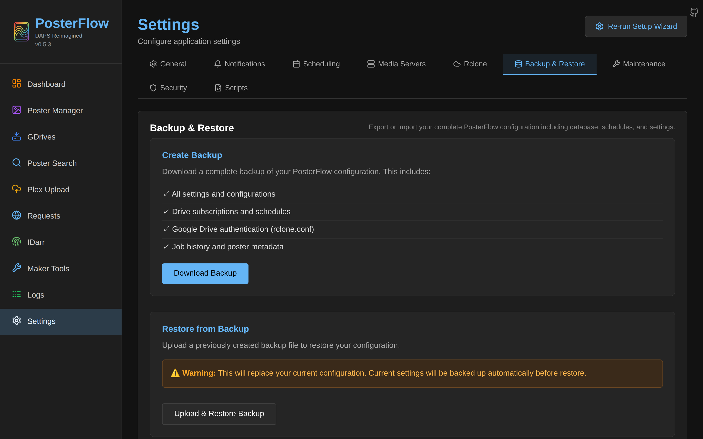

# Backup & Restore

PosterFlow exposes a built-in backup/restore endpoint that packages the minimum set of files needed to recreate your install on a new host. The endpoints are `GET /api/backup/` and `POST /api/backup/` in [`backend/api/backup.py`](https://github.com/dweagle/posterflow/blob/develop/backend/api/backup.py). The Settings → Backup & Restore tab is a thin client over them.



## What's in a backup

A backup is a single ZIP file. The schema:

```
posterflow-backup-YYYYMMDD-HHMMSS.zip
├── posterflow.db        # SQLite database. Whole app state. Always present.
├── rclone.conf          # rclone config with Google credentials. Present if file exists at backup time.
├── drives_cache.json    # Last-fetched community drive preset list. Present if file exists.
└── metadata.json        # {"version": "0.5.3", "created_at": "2026-05-25T17:42:11Z"}
```

What's **not** included:

- Anything under `/config/posters/` — the GDrive cache and the destination assets. These can be regenerated by syncing again (after a restore, you'll sync into an empty cache and PosterFlow downloads everything fresh).
- `/config/logs/` — discarded.
- `/config/idarr/` — IDarr working directory, transient.
- `/config/scripts/` — your custom hook scripts. **You must back these up separately.**
- `/config/service_accounts/` — Google service-account JSON files. **You must back these up separately.**
- `/assets/` and `/idarr/` — external mounts. Back them up the same way you back up the rest of your homelab.

The 50 MB upload limit on `POST /api/backup/` is enforced server-side; you'll only hit it if your SQLite DB grows past ~50 MB (rare; a 50k-poster install runs to maybe 30 MB).

## Downloading a backup

From the UI: Settings → Backup & Restore → Download Backup. The server zips the three files, writes the result to a tempfile, streams the response with `Content-Disposition: attachment; filename=posterflow-backup-<timestamp>.zip`, and deletes the tempfile after the response finishes.

From the command line:

```bash
curl -s -H "Authorization: Bearer <pwd>" \
  -o posterflow-backup.zip \
  http://localhost:8357/api/backup/
```

You can wire this into your existing backup cron:

```bash
# /etc/cron.daily/posterflow-backup
#!/bin/bash
set -euo pipefail

DEST=/srv/backups/posterflow
mkdir -p "$DEST"
DATE=$(date +%Y%m%d-%H%M%S)

curl -sf -H "Authorization: Bearer ${POSTERFLOW_PASSWORD}" \
  -o "$DEST/posterflow-backup-${DATE}.zip" \
  http://localhost:8357/api/backup/

# Also grab the host-side service accounts and scripts dir if you use them.
tar -cJf "$DEST/posterflow-extras-${DATE}.tar.xz" \
  -C /srv/posterflow/config \
  service_accounts scripts 2>/dev/null || true

# Retention: keep 14 daily, delete older.
find "$DEST" -name 'posterflow-backup-*.zip' -mtime +14 -delete
find "$DEST" -name 'posterflow-extras-*.tar.xz' -mtime +14 -delete
```

The backup endpoint reads the live SQLite file via a normal filesystem read. Because PosterFlow uses WAL mode, the DB **may** have uncommitted pages in `.wal` at the moment of read. SQLite's read isolation handles this correctly — the backed-up file represents a consistent snapshot of the DB up to the last checkpoint. For a guaranteed-quiescent backup, stop the container first:

```bash
docker compose stop posterflow
cp /srv/posterflow/config/posterflow.db /srv/backups/posterflow.db.cold
docker compose start posterflow
```

But for daily snapshots, the live-export path is fine.

## Restoring

Two routes: through the wizard's Welcome screen (on a fresh `/config`), or through Settings → Backup & Restore (in an existing install).

### From the wizard

On first boot with an empty `/config`, the welcome screen has a "Restore Backup" card. Upload your zip there; PosterFlow restores it and prompts you to restart the container.

### From Settings

On an existing install, Settings → Backup & Restore → Upload Backup. Same `POST /api/backup/` endpoint, same flow. After a successful restore, a Restart Required modal appears — clicking restart sends a `SIGTERM` to the container indirectly by calling… actually, PosterFlow can't restart its own container. The modal instructs you to restart the container manually with `docker compose restart posterflow` (or whatever your orchestration uses).

### What restore actually does

`POST /api/backup/` unzips the upload into a tempdir, then:

1. **Validates the zip.** Each member's resolved path must be inside the tempdir (`is_relative_to`). Members that fail are logged and the restore aborts. This protects against Zip-Slip-style attacks where an archive contains paths like `../../etc/passwd`.
2. **Reads `metadata.json`** for the source version. Logs it. Does not enforce any version compatibility check — PosterFlow assumes Alembic migrations on the new container will forward-migrate any older schema.
3. **Snapshots existing files to safety_backups.** Before overwriting anything, the current `posterflow.db`, `rclone.conf`, and `drives_cache.json` are copied into `/config/safety_backups/<timestamp>/`. You can roll back manually by stopping the container and copying these back into place.
4. **Overwrites the live files** with the backup contents.
5. **Returns** a summary like `{"message": "Backup restored", "restored_files": {"database": true, "rclone_config": true, "drives_cache": true}}`.

### After restore, before restart

Migrations run on next startup. If the backup was taken from an older PosterFlow version with an older schema, Alembic will apply the missing migrations before serving requests. Migrations are transactional and idempotent. If the migration fails, the lifespan raises and the container won't reach a healthy state — see [`troubleshooting.md`](troubleshooting.md#migration-failed).

### Backing out a restore

If the restore was a mistake:

1. Stop the container: `docker compose stop posterflow`.
2. Move the offending files aside:
   ```bash
   cd /srv/posterflow/config
   mv posterflow.db posterflow.db.bad
   mv rclone.conf rclone.conf.bad
   mv drives_cache.json drives_cache.json.bad
   ```
3. Copy the safety backup into place:
   ```bash
   cp safety_backups/<timestamp>/posterflow.db posterflow.db
   cp safety_backups/<timestamp>/rclone.conf rclone.conf
   cp safety_backups/<timestamp>/drives_cache.json drives_cache.json
   ```
4. Start: `docker compose start posterflow`.

The same `safety_backups/<timestamp>/` directories accumulate every time you restore — they're not pruned automatically. Periodically remove old ones if disk pressure matters.

## Migrating to a new host

Standard procedure:

1. On the old host, take a backup via the UI or curl.
2. Also copy `/config/service_accounts/` and `/config/scripts/` from the old host if you used them.
3. On the new host, run the canonical compose with a fresh empty `/config` directory. Start the container.
4. The wizard appears at the welcome screen. Choose Restore Backup, upload the zip.
5. Wait for the success response, then restart the container.
6. After restart, copy the service accounts and scripts directories into `/srv/posterflow/config/service_accounts/` and `/srv/posterflow/config/scripts/` respectively. Make sure ownership matches `PUID:PGID`.
7. Hit the dashboard. Subscribed drives are present, schedules are present, settings are intact. Run a single Sync against one drive to verify rclone credentials still work — if you used a service-account JSON, double-check the file is mounted at the path your settings expect.

## Recovering from a corrupted DB

Symptoms: container fails to start with `database is locked`, `disk image is malformed`, `unable to open database file`, or repeated migration errors.

Try in order:

1. **Check for sidecar files.** WAL mode creates `posterflow.db-wal` and `posterflow.db-shm` next to the DB. These are required for read consistency. If they were partially deleted or corrupted, SQLite refuses to open the DB. Stop the container; if the sidecars look truncated (size 0 or much smaller than the WAL frame size), delete them and let SQLite recreate them on next open.

2. **WAL checkpoint via the sqlite3 CLI.** With the container stopped:
   ```bash
   docker run --rm -v /srv/posterflow/config:/c alpine:3 \
     sh -c "apk add --no-cache sqlite && sqlite3 /c/posterflow.db 'PRAGMA wal_checkpoint(TRUNCATE);'"
   ```
   This forces unmerged WAL pages into the main DB and truncates the WAL file. If this succeeds but the container still won't start, the DB itself is the problem, not the WAL.

3. **Run `PRAGMA integrity_check`.** Same approach:
   ```bash
   docker run --rm -v /srv/posterflow/config:/c alpine:3 \
     sh -c "apk add --no-cache sqlite && sqlite3 /c/posterflow.db 'PRAGMA integrity_check;'"
   ```
   `ok` means the DB is structurally sound — your problem is elsewhere (migrations, permissions). Anything else means real corruption — restore from backup.

4. **Restore from backup.** The official path. Stop the container, replace `/config/posterflow.db` with a known-good copy, restart.

5. **Last resort: start over.** Stop the container, delete `posterflow.db*`, restart. You'll re-walk the setup wizard and re-subscribe drives. Drive cache files in `/config/posters/gdrive/*` are preserved — the first sync after fresh setup will re-walk those local folders and re-create poster records in the new DB without re-downloading.

## Exporting / importing settings without the full backup

There's no per-setting export/import API. If you want to move just one setting (e.g., copy a Discord webhook config from staging to prod), use the bulk endpoints:

```bash
# Export — masked sensitive values come back as "***masked***"
curl -s -H "Authorization: Bearer <pwd>" \
  http://localhost:8357/api/settings/ > settings.json

# Reveal a single masked setting (returns the real value):
curl -s -H "Authorization: Bearer <pwd>" \
  -H "Content-Type: application/json" \
  -d '{"setting_key":"discord_notifications_webhook_url"}' \
  http://prod-host:8357/api/settings/reveal

# Import on the destination — only allowlisted keys are accepted.
# See backend/api/settings.py BULK_SETTINGS_ALLOWLIST.
curl -s -H "Authorization: Bearer <pwd>" \
  -X POST -H "Content-Type: application/json" \
  -d @cleaned-settings.json \
  http://localhost:8357/api/settings/bulk
```

Cleaning `settings.json` of masked values is your job — leave a `***masked***` value in and the bulk import treats it as "no change" rather than blanking the key.
