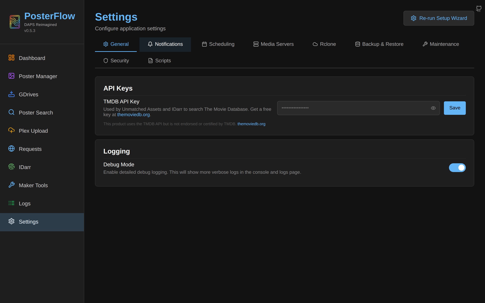
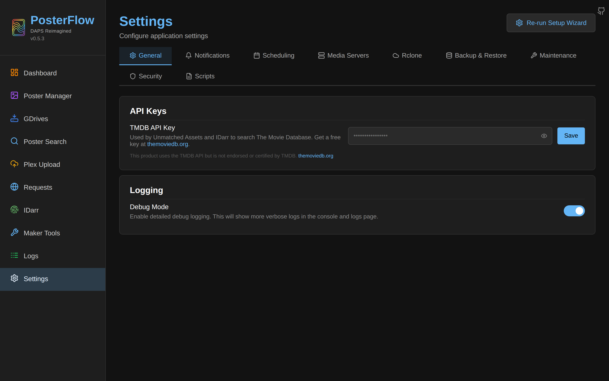
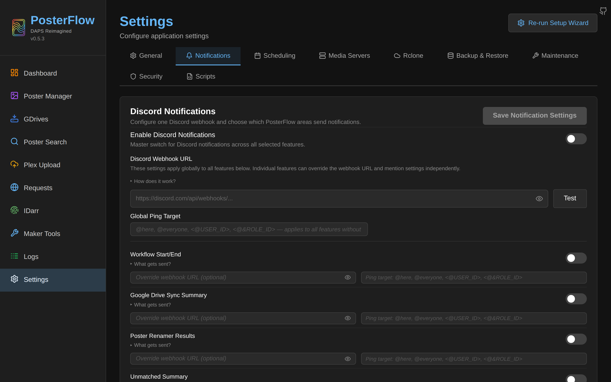
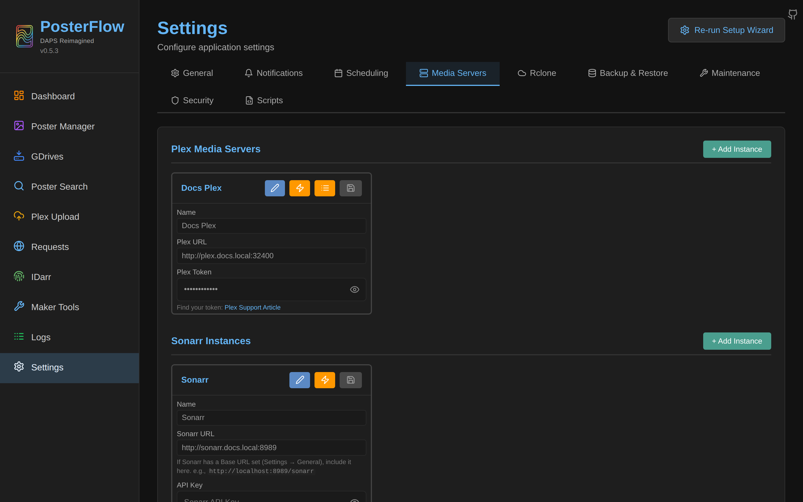
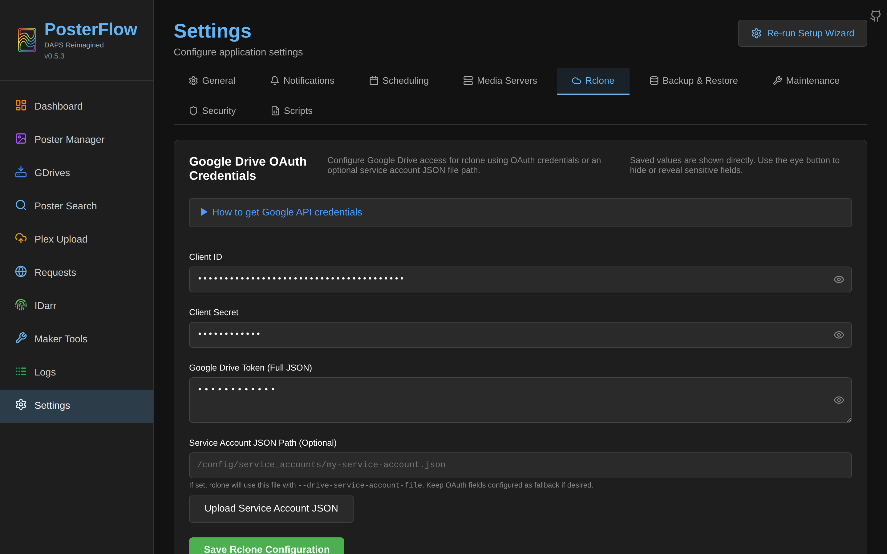
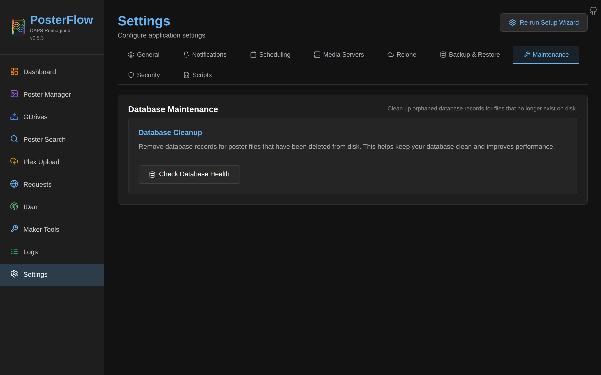

# Configuration

PosterFlow has three layers of configuration. They sit at distinct points in the lifecycle and you can't mix them up:

1. **Environment variables.** Read once at process start by `backend/core/config.py` (a Pydantic `BaseSettings`). Changing one requires a container restart. Covered in [`install.md`](install.md#environment-variables).
2. **The SQLite `settings` table.** Every UI-exposed knob persists here as a `(key, value)` row. Read either at startup (e.g., the persisted debug toggle) or on-demand per request. Most changes are hot — they take effect on the next job. A few require restart and the UI flags them.
3. **On-disk files in `/config`.** `rclone.conf`, the SQLite DB itself, the drives cache, the job logs and the after-job scripts. PosterFlow writes these as a side effect of UI actions; you should not edit them by hand unless you understand what you're doing.

This page is the cross-cutting reference: every UI panel, every setting key, every file. Per-feature deep-dives live in [`drives.md`](drives.md), [`jobs.md`](jobs.md), [`scheduler.md`](scheduler.md), [`notifications.md`](notifications.md) and [`security.md`](security.md).

## Settings page layout

Settings has nine tabs, in the order rendered by [`frontend/src/components/settings/SettingsTabs.tsx`](https://github.com/dweagle/posterflow/blob/develop/frontend/src/components/settings/SettingsTabs.tsx). The active tab is persisted to `localStorage` under `posterflow.settings.activeTab`. The "Re-run Setup Wizard" button at top-right is always visible.


*The Settings page on first navigation. Active-tab state persists across reloads via localStorage.*


*The General tab content. Every tab on the strip is covered below.*

### General

The General tab in 0.5.3 surfaces a small set of poster-destination and file-operation controls. The same fields exist on the Poster Manager → Settings tab; this is a convenience surface for operators who don't want to dig into the Poster Manager UI.

### Notifications


*Discord global config plus per-feature override toggles.*

Full coverage in [`notifications.md`](notifications.md). Persists to:

| Key | Type | Purpose |
|---|---|---|
| `discord_notifications_enabled` | bool | Master switch. |
| `discord_notifications_webhook_url` | url (masked) | Validated against `^https://discord(app)?\.com/api/webhooks/`. |
| `discord_notifications_mention` | string | `@here`, `@everyone`, `<@USER_ID>`, `<@&ROLE_ID>`, or a bare snowflake. |
| `discord_notifications_mention_on_error` | bool | Apply the mention on error events. |
| `discord_notifications_mention_on_success` | bool | Apply the mention on success events. |
| `discord_notifications_features` | JSON | Per-feature overrides for `sync`, `workflow`, `poster_renamer`, `border_replacer`, `unmatched_assets`, `plex_upload`, `idarr`, `maker_monitor`, `system_errors`. |

### Scheduling


*Empty state of the Scheduling tab.*

Full coverage in [`scheduler.md`](scheduler.md). Schedules persist to the `schedules` table — not the settings table — because APScheduler's `SQLAlchemyJobStore` needs SQL access to them.

### Media Servers


*Each section holds zero or more instances and exposes a Test Connection button per instance.*

Persists to `plex_instances`, `sonarr_instances`, `radarr_instances` (all JSON arrays of `{name, url, api_key}`). The `api_key` inside each element is masked on read; see [`security.md`](security.md#sensitive-data-on-disk).

The Plex section also exposes a "Select Libraries" button per instance which opens `PlexLibraryModal`. Selecting libraries here populates `poster_renamer_libraries` and `unmatched_assets_libraries` (JSON arrays of library keys like `"<instance_name>:<library_key>"`). Only selected libraries are scanned by the matching engine — see [`jobs.md`](jobs.md#poster-renamer).

### Rclone


*The same four fields as wizard Step 1, plus the GDrive storage path override and a Service Account upload helper.*

Persists to `google_client_id`, `google_client_secret`, `google_token`, `google_refresh_token`, `google_service_account_file`, `gdrive_storage_path`. The `Upload Service Account JSON` button uses `POST /api/settings/service-account/upload`, which writes the file under `/config/service_accounts/<filename>` and sets `google_service_account_file` to that path.

### Backup & Restore


*Backup contents and restore behavior are documented in [`backup-restore.md`](backup-restore.md).*

### Maintenance


*The Maintenance tab calls `/api/database/cleanup/*` and `/api/database/stats`.*

The "Cleanup orphaned records" button calls `POST /api/database/cleanup/execute` with `confirm=true`. It deletes `posters` rows whose `file_path` no longer exists on disk, **excluding** records with `drive_id="border_processed"` (which are internal tracking rows for the Border Replacer's incremental cache). Run this if you've deleted a drive's local cache out-of-band and want to clean up dangling DB rows. See [`troubleshooting.md`](troubleshooting.md#stale-records).

### Security


*See [`security.md`](security.md#app-password) for the threat model and password storage.*

Persists to `app_password_hash` and `app_password_salt` via `/api/auth/set`. Both are PBKDF2-HMAC-SHA256 derived (260,000 iterations, 32-byte salt) and never returned by any read endpoint. Clearing the password sends `POST /api/auth/clear` with the current password as confirmation; this writes empty strings into both keys.

### Scripts


*Hook configuration. See [`scheduler.md`](scheduler.md#after-job-scripts) for the script execution contract.*

Persists to `post_job_hooks` (JSON object keyed by hook name) and `hooks_script_logging` (bool, default `true`).

## Setting catalog

Every setting key the UI can write, by area. Defaults and types are taken from the code; ranges are taken from validation in the corresponding API endpoint.

### Media servers

| Key | Type | Default | Effect |
|---|---|---|---|
| `plex_instances` | JSON array of `{name, url, api_key}` | `[]` | Plex servers the Poster Renamer, Unmatched Detection and Plex Upload jobs talk to. |
| `sonarr_instances` | JSON array of `{name, url, api_key}` | `[]` | Sonarr servers consulted for series metadata and seasons. |
| `radarr_instances` | JSON array of `{name, url, api_key}` | `[]` | Radarr servers consulted for movie metadata. |
| `plex_token` | string (masked, legacy) | `""` | Single-server legacy field. Newer installs use `plex_instances`; this is read as a fallback only. |
| `poster_renamer_libraries` | JSON array of `"<instance>:<library_key>"` | `[]` | Whitelist of Plex libraries to consider during renamer match. Empty = all libraries. |
| `unmatched_assets_libraries` | JSON array | `[]` | Same shape, scopes Unmatched Detection. |

### Drives and storage

| Key | Type | Default | Effect |
|---|---|---|---|
| `google_client_id` | string | `""` | OAuth client ID. Written to `/config/rclone.conf` under `[gdrive]`. |
| `google_client_secret` | string (masked) | `""` | OAuth client secret. |
| `google_refresh_token` | string (masked) | `""` | OAuth refresh token. |
| `google_token` | string (masked) | `""` | Legacy combined token JSON. Newer installs leave this empty. |
| `google_service_account_file` | string (path) | `""` | Absolute container path to a service-account JSON. Takes precedence over OAuth if set. |
| `gdrive_storage_path` | string (path) | `""` (resolves to `/config/posters/gdrive`) | Where `rclone sync` writes drive caches. Restored at startup; change requires restart to take effect on existing in-flight syncs. |
| `poster_destination` | string (path) | `""` (resolves to `/config/posters/assets`) | Where the renamer writes organized output. Hot — next job picks it up. |

### Poster Renamer

| Key | Type | Default | Effect |
|---|---|---|---|
| `poster_action_type` | enum `copy`/`move`/`hardlink`/`symlink` | `copy` | File operation when writing into the destination. |
| `poster_asset_folders` | bool | `true` | If true, each item is wrapped in `<destination>/<folder>/poster.jpg`; if false, files are flattened with descriptive names. |
| `poster_drive_priority` | JSON `{drive_ids, enabled_styles}` | `{[], []}` | Order in which drives are considered. First match wins on duplicates. |
| `auto_run_border` | bool | `false` | If true, the renamer kicks off the Border Replacer in the same job on completion. |
| `match_threshold` | float 0.0–1.0 | (job default, see code) | Fuzzy-match cutoff for fallback title matching. |

### Unmatched Detection

| Key | Type | Default | Effect |
|---|---|---|---|
| `tmdb_api_key` | string (masked) | `""` | v3 TMDB API key. Required for TMDB links in the Unmatched report and for Maker Tools TMDB Search. |
| `unmatched_ignore_root_folders` | string (comma/newline list) | `""` | Folder-name patterns to skip during media-server scan. |
| `unmatched_ignore_collections` | string (comma/newline list) | `""` | Plex collection titles to skip. |
| `unmatched_ignore_unmonitored` | bool | `false` | If true, items marked unmonitored in Radarr/Sonarr are excluded from the report. |

### Border Replacer

| Key | Type | Default | Effect |
|---|---|---|---|
| `border_replacer_colors` | JSON array of hex strings | `[]` | Cycle of colors applied. `["#000000"]` for black; multiples are cycled per file in scan order. |
| `border_replacer_width` | int (pixels) | `26` | Crop/repaste width on each side. The output is always resized to 1000×1500 regardless. |
| `border_replacer_mode` | enum `incremental`/`full` | `incremental` | `incremental` skips files whose source mtime+size haven't changed since the last run. |
| `border_replacer_holidays` | JSON object | `{}` | Date-range-keyed color overrides. See [`jobs.md`](jobs.md#border-replacer). |
| `border_replacer_skip_non_holiday` | bool | `false` | If true and no holiday matches today, the job copies files through without applying borders. |
| `border_replacer_remove_borders` | bool | `false` | If true, the job removes existing borders instead of adding them. Mutually exclusive with `border_replacer_colors`. |
| `border_replacer_exclusions` | JSON array of strings | `[]` | Folder names (case-insensitive substring match) to skip entirely. |

### Scheduler

Schedules persist to the `schedules` SQL table, not the `settings` table. See [`scheduler.md`](scheduler.md).

### Plex Upload

| Key | Type | Default | Effect |
|---|---|---|---|
| `plex_webhook_enabled` | bool | `false` | If true, `POST /api/posterflow/plex-upload/webhook` accepts Radarr/Sonarr webhook payloads. |
| `plex_webhook_rename_then_upload` | bool | `false` | If true, webhook triggers a rename pass before uploading. |
| `plex_webhook_remove_overlay_label` | bool | `false` | If true, the Kometa "overlay" label is removed from the Plex item before upload. |
| `plex_webhook_adopt_existing_processed` | bool | `false` | If true, an already-processed file is uploaded again rather than skipped. |
| `plex_webhook_retry_attempts` | int 1–10 | `3` | Per-item retry budget on transient failures. |
| `plex_webhook_retry_delay_seconds` | int 1–300 | `5` | Backoff between retries. |
| `plex_webhook_upload_delay_ms` | int | `0` | Delay between successive uploads, to avoid hammering Plex. |
| `plex_upload_library_override` | JSON `{enabled, configs[], global_configs}` | `{enabled:false, configs:[]}` | Optional per-instance/per-library override of upload behavior. |
| `plex_upload_manual_dry_run` | bool | `false` | Default dry-run state of the manual upload form. |
| `plex_upload_manual_reapply` | bool | `false` | Default "Reapply" state. |
| `plex_upload_manual_remove_overlay_label` | bool | `false` | Default "Remove Overlay Label" state. |
| `plex_upload_manual_sync_before_upload` | bool | `false` | Default "Sync Before Upload" state. |
| `plex_upload_manual_rename_before_upload` | bool | `false` | Default "Rename Before Upload" state. |
| `plex_upload_manual_border_before_upload` | bool | `false` | Default "Border Before Upload" state. |
| `plex_upload_manual_upload_delay_ms` | int | `0` | Default manual upload delay. |

### IDarr and Maker Tools

| Key | Type | Default | Effect |
|---|---|---|---|
| `maker_tools_idarr_config` | JSON | `{}` | Sync targets (label, personal drive ID, source folder), behavior toggles. |
| `maker_tools_monitor_config` | JSON | `{}` | Monitor settings (frequency days, tvdb frequency, limit). Contains a masked `tmdb_api_key` field used only as a legacy fallback — the global `tmdb_api_key` is preferred. |
| `psd_export_folder` | string (path) | `""` | Where Maker Tools writes exported PSDs. |
| `psd_template_path` | string (path) | `""` | Path to the bundled or custom PSD template. |
| `psd_open_photopea` | bool | `false` | If true, exported PSDs open in [photopea.com](https://www.photopea.com) in a new tab. Requires the CORS allowance for `https://www.photopea.com` (default). |

### App / system

| Key | Type | Default | Effect |
|---|---|---|---|
| `setup_complete` | bool string | `"false"` | Drives the wizard redirect. Set to `"true"` by the wizard or by Skip Setup. |
| `debug_enabled` | bool string | unset | In-app debug toggle. If set, overrides the `DEBUG` env var on every restart. |
| `app_password_hash` | hex string | unset | Never exposed; see [`security.md`](security.md#app-password). |
| `app_password_salt` | hex string | unset | Never exposed; see [`security.md`](security.md#app-password). |
| `community_rate_date` | UTC date string | unset | Internal counter for community-request rate limiting. |
| `community_rate_count` | int string | unset | Internal counter. |

### Scripts / hooks

| Key | Type | Default | Effect |
|---|---|---|---|
| `post_job_hooks` | JSON object | `{}` | Keyed by hook name (`sync_one`, `sync_all`, `poster_workflow`, `poster_renamer`, `border_replacer`, `unmatched`). Each value: `{enabled, script, run_when, trigger_on}`. |
| `hooks_script_logging` | bool string | `"true"` | If `false`, the after-job runner suppresses stdout capture. Errors are still logged. |

## What's in `/config`

Everything created on disk by a running container, exhaustive. Files in **bold** are critical; lose them and you lose state.

```
/config/
├── posterflow.db                 # SQLite database. The whole app state.
├── posterflow.db-wal             # SQLite WAL sidecar. Present while WAL has unmerged pages.
├── posterflow.db-shm             # SQLite shared-memory sidecar. Always present alongside -wal.
├── rclone.conf                   # rclone configuration. [gdrive] section written by PosterFlow.
├── drives_cache.json             # Last-fetched community drive preset list.
├── logs/
│   ├── posterflow.log            # Application log. 10MB rotation, 1 backup.
│   ├── posterflow.log.1          # Rotated previous log (gzipped on rotation by Loguru? see code).
│   ├── sync_one/                 # Per-job-type log dir. One file per job, keeps 10 newest.
│   │   └── sync_one.log
│   ├── sync_all/
│   ├── poster_renamer/
│   ├── border_replacer/
│   ├── unmatched_assets/
│   ├── plex_upload/
│   ├── workflow/
│   └── idarr/
├── idarr/                        # IDarr working dir. Source files staged here by uploads.
├── scripts/                      # After-job scripts. You drop executable files here.
│   └── <user-supplied>.sh
├── posters/                      # Default poster cache and assets dir.
│   ├── gdrive/                   # rclone destination. Created on first sync.
│   │   ├── CL2K/
│   │   │   └── <drive-name>/
│   │   ├── MM2K/
│   │   │   └── <drive-name>/
│   │   └── Custom/
│   │       └── <drive-name>/
│   └── assets/                   # Default poster_destination. Renamer output lands here.
│       ├── tmp/                  # Renamer's temp staging when "auto-run border" is set.
│       └── <Title (Year)>/       # Organized output, one folder per item.
│           ├── poster.jpg
│           ├── Season01.jpg
│           └── ...
├── service_accounts/             # Created on first service-account upload via UI.
│   └── <uploaded>.json
└── safety_backups/               # Pre-restore snapshots of overwritten files. See backup-restore.md.
    └── <timestamp>/
        ├── posterflow.db
        └── rclone.conf
```

**Safe to delete while the container is stopped:**

- `logs/` and any subdirectory under it — logs regenerate.
- `posters/gdrive/<any-drive>/` — next sync re-downloads. Be aware of Google's daily quota.
- `posters/assets/tmp/` — temp staging only.
- `safety_backups/<timestamp>/` — pre-restore snapshots you don't intend to roll back to.

**Never delete (while the container is running):**

- `posterflow.db*` — corrupts state.
- `rclone.conf` — breaks the next sync until the wizard is re-run.

**Back up:**

- `posterflow.db` — the canonical state. Stop the container before copying (WAL sidecars are part of the consistent image).
- `rclone.conf`.
- Optionally `drives_cache.json` and `service_accounts/` for fast disaster recovery.

The built-in backup endpoint (`GET /api/backup/`) packages all of these — see [`backup-restore.md`](backup-restore.md).

## What requires a restart

Per the code, this short list of changes needs `docker compose restart` to take effect cleanly:

- `gdrive_storage_path` change while a sync is queued or running. (New value is read at startup; in-flight jobs use the old path.)
- Any environment variable change (`PUID`, `PGID`, `TZ`, `DEBUG`, `LOG_LEVEL`, `CORS_ORIGINS`, `MALLOC_ARENA_MAX`).
- Adding or removing entries from the bundled migration list (you upgraded the image).
- App password change does **not** require restart — the auth middleware uses a 5-second TTL cache against the DB.

Hot changes (no restart, picked up on next job):

- Every setting in the per-feature tables above unless explicitly noted.
- Adding, editing, removing schedules — `update_schedules()` rebuilds the APScheduler job table immediately.
- Subscribing/unsubscribing drives, changing drive priority.
- Editing after-job hooks. Scripts are looked up by name at job-end.
- Debug toggle (Logs page) — `setup_logging(debug_enabled=...)` is called inline.

## CORS

The CORS allowlist is the comma-separated value of `CORS_ORIGINS` (default in `backend/core/config.py`: localhost on `:8357` and `:5173`, plus `https://www.photopea.com`). The middleware accepts any method and any header but **does not** allow credentials (`allow_credentials=False`). If you put PosterFlow behind a reverse proxy on a different hostname, add that hostname to `CORS_ORIGINS` or the browser will block API calls. See [`reverse-proxy.md`](reverse-proxy.md) for working examples.

The `https://www.photopea.com` origin is required for Maker Tools' Photopea integration to round-trip a saved PSD back to PosterFlow. Removing it disables that feature. PosterFlow also echoes the `Access-Control-Allow-Private-Network: true` header on request when Chrome's Private Network Access preflight asks for it (see `backend/main.py` lines 424–437) — this is also for Photopea reaching a LAN-hosted PosterFlow.
