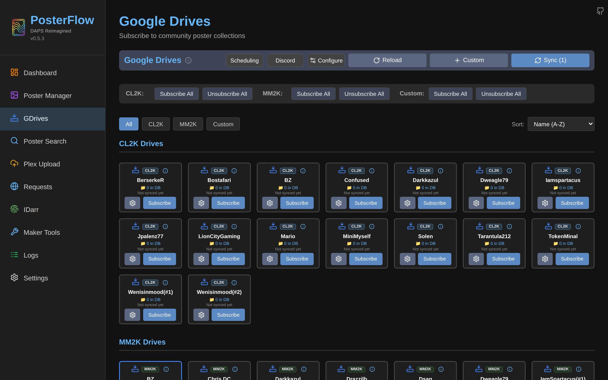
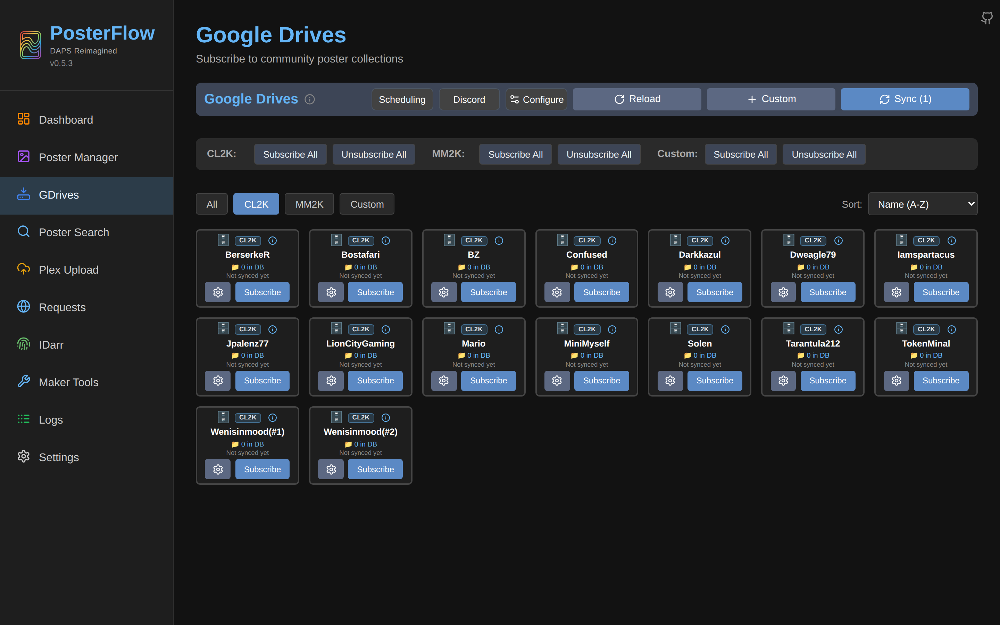
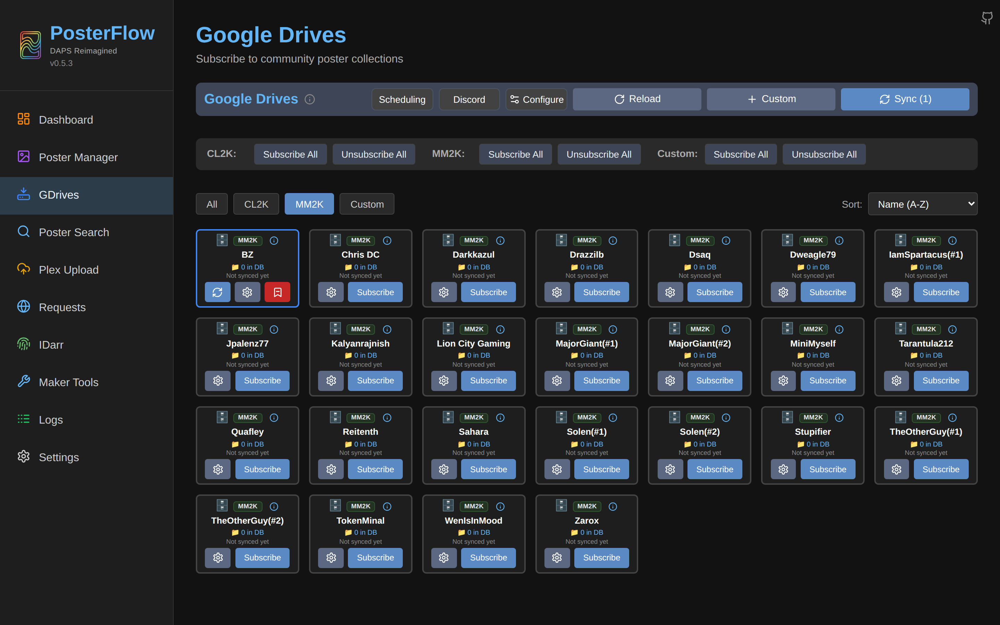
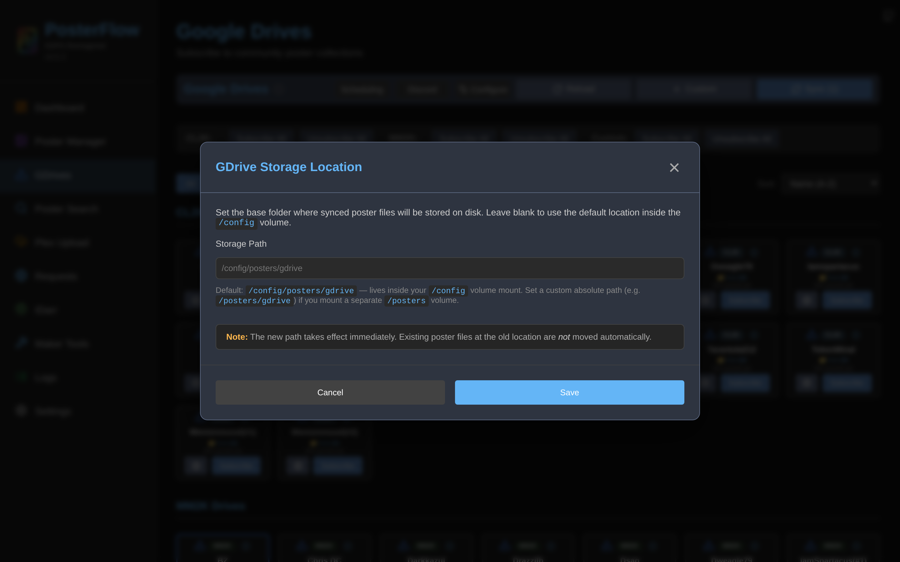

# Drives

The GDrives page is where you subscribe to community-maintained poster collections, add your own Google Drive sources, and trigger syncs. The page is implemented in [`frontend/src/pages/GDrives.tsx`](https://github.com/dweagle/posterflow/blob/develop/frontend/src/pages/GDrives.tsx); the API surface lives in [`backend/api/drives.py`](https://github.com/dweagle/posterflow/blob/develop/backend/api/drives.py); the sync logic in [`backend/services/poster_sync.py`](https://github.com/dweagle/posterflow/blob/develop/backend/services/poster_sync.py) and the rclone wrapper in [`backend/services/rclone.py`](https://github.com/dweagle/posterflow/blob/develop/backend/services/rclone.py).


*The Drives page in its default state. Cards are grouped by style under section headers.*

Switching to a specific style filter collapses the grouping to a flat grid:


*The drives list filtered to CL2K. Each card represents one Google Drive folder. The first card row shows the result of `load_drives_data()` reading the upstream community preset list.*

## Where the community drives come from

On every startup, `backend/main.py`'s lifespan calls `load_drives_data()` (`backend/services/drive_loader.py`). It tries:

1. `GET https://raw.githubusercontent.com/dweagle/posterflow/develop/backend/assets/drives.json?t=<unix-timestamp>` with `Cache-Control: no-cache` and a 10-second timeout. The cache-busting query string defeats any HTTP cache between the container and GitHub.
2. On success, the response is written to `/config/drives_cache.json`.
3. On failure (timeout, HTTP error, JSON parse error), it falls back to reading `/config/drives_cache.json`.
4. If both fail, startup logs `Application will continue, but drives may not be available` and the drives list stays empty.

Each entry in `drives.json` has this shape:

```json
{
  "drives": [
    {
      "key": "BerserkeR-CL2K",
      "name": "BerserkeR",
      "folder_id": "1A2B3C…long-gdrive-folder-id…",
      "type": "poster",
      "style_type": "2k"
    }
  ]
}
```

These entries are upserted into the `drives` SQL table via `load_drives_from_json()`. As of 2026-05-25 the upstream file contains 41 drives. The community list is curated by the project maintainer; new drives appear when they are added to the GitHub file, and a drive is marked **deprecated** in the local DB if a previously-known drive disappears from the upstream list (`is_deprecated=true` on the `drives` row). A deprecated drive can still be unsubscribed and deleted but won't be re-fetched.

You can force a reload at any time by clicking the **Reload** button on the GDrives page — this calls `POST /api/drives/reload`, which re-runs the same `load_drives_data()` flow.

## Drive styles

There are three "styles" of drive in the data model:

| Style | Provenance | Layout |
|---|---|---|
| **CL2K** | Community-curated. Comes from the upstream `drives.json` with `style_type` matching CL2K conventions. | `/config/posters/gdrive/CL2K/<drive-name>/` |
| **MM2K** | Community-curated. Same source, different conventions. | `/config/posters/gdrive/MM2K/<drive-name>/` |
| **Custom** | User-added via the "+ Custom" button. | `/config/posters/gdrive/Custom/<drive-name>/` or any path you specify in `custom_path`. |

The naming of CL2K and MM2K is historical from the DAPS community. The two styles differ in how poster makers structure their folders inside Google Drive — CL2K-style drives put each title in a flat folder; MM2K-style drives use a different nesting. The renamer's matching logic doesn't care about the style itself but the Drive Priority UI (Poster Manager → Drive Priority) lets you toggle styles independently so you can, for example, prefer all MM2K artwork over CL2K.

A drive whose `drive_id` starts with `manual-` (the prefix the API uses when you create a Custom drive without providing a Google Drive folder ID) is treated as **local-only**: no rclone sync is attempted, but the local folder is scanned for posters and tracked in the DB. This is useful for local-only artwork directories you maintain by hand. See migration `0002_add_sync_enabled_to_drives.py` for the data semantics.

## Subscribing to a drive

Click **Subscribe** on any unsubscribed drive card. This calls `POST /api/drives/{id}/subscribe` and:

1. Marks `drives.subscribed = true`.
2. For local drives (those with `manual-` IDs), kicks off a background scan job to populate the `posters` table from existing local files.
3. For remote drives, the drive becomes eligible for syncing via the **Sync (N)** button or via a scheduled job.

The "**Subscribe All**" bulk-action buttons at the top of the page do the same thing per style. **Unsubscribe** sets `subscribed = false` and removes the drive from any drive-priority list it was in. Unsubscribing does **not** delete the local cache — files stay on disk until you delete the drive or manually clean them up.

## Syncing

The **Sync (N)** button at the top of the page kicks off a sync of every subscribed drive (its label shows N = the count of subscribed drives). The per-card **Sync** button on each subscribed card kicks off a single-drive sync. Both call `POST /api/jobs/sync` or `POST /api/jobs/sync-all` respectively, which enqueue jobs onto the global thread-pool (max workers = 1; concurrent syncs are queued).

### rclone invocation

The exact subprocess invocation for a single-folder sync, from `backend/services/rclone.py` line 191:

```bash
rclone sync \
  gdrive,root_folder_id=<DRIVE_FOLDER_ID>: \
  /config/posters/gdrive/<style>/<drive_name>/ \
  --config /config/rclone.conf \
  <auth args>                                  # see below
  --fast-list \
  --tpslimit=8 \
  --size-only \
  --no-update-modtime \
  --check-first \
  --stats 1s \
  --stats-log-level NOTICE \
  -v
```

Where `<auth args>` is one of:

- `--drive-service-account-file /path/to/sa.json` if `google_service_account_file` is set, **or**
- nothing extra — the OAuth client ID, secret and token are read out of `/config/rclone.conf` `[gdrive]` section. `_write_oauth_to_config()` puts them there at sync time so they don't appear in `ps aux` / `/proc/<pid>/cmdline`.

Decoding the flags:

| Flag | Why PosterFlow sets it |
|---|---|
| `gdrive,root_folder_id=<id>:` | Scopes the remote to a single Drive folder, so the same `[gdrive]` config can serve any number of drives. |
| `--fast-list` | Single recursive listing instead of per-directory; required for large drives. |
| `--tpslimit=8` | Caps Drive API calls to 8 per second. Google's free quota allows more, but 8/s avoids transient 403 rate-limit responses on shared API projects. |
| `--size-only` | Compares files by size only, not mtime+size. Together with `--no-update-modtime` it keeps mtimes stable for the next run's `filecmp` check inside `poster_sync.py`. |
| `--no-update-modtime` | Don't bump local mtime to current time after a successful transfer. |
| `--check-first` | Complete the file-listing phase before starting any transfers — gives PosterFlow a stable total for progress reporting. |
| `--stats 1s` + `--stats-log-level NOTICE` | Emit a `Transferred: X / Y` line every second so the websocket can stream live progress. |
| `-v` | Per-file INFO output so the per-file progress callback can fire. |

If the rclone process exits non-zero, the last 50 stdout lines are captured in the error report and the job is marked `failed`. Common causes are documented in [`troubleshooting.md`](troubleshooting.md#rclone-auth-fails).

### What happens after the rclone transfer

`PosterSyncService.sync_drive()` runs a five-phase pipeline; rclone is just phase 1. After rclone returns, the service:

1. Scans the local folder for image files (`.jpg`, `.jpeg`, `.png`, `.webp`).
2. Loads existing `posters` rows for this drive's `drive_id`.
3. Computes a diff between the filesystem and the DB:
   - Files on disk missing from DB → **added** (insert new rows).
   - Files in DB missing from disk → **deleted** (remove rows).
   - Files where mtime differs by more than 1.0 second or size changed → **updated** (mark `last_processed=NULL` so the renamer reprocesses them).
4. Flushes the DB in batches of 500 rows.
5. Updates `drives.last_synced`, `drives.sync_file_count` and `drives.last_files_transferred` so the card UI reflects the new state.

Idempotency: running the same sync twice in a row produces an `added=0, updated=0, deleted=0` second pass. The renamer's downstream incremental tracking depends on this — see [`jobs.md`](jobs.md#poster-renamer).

### Rate limits

The default `--tpslimit=8` is hardcoded in the rclone wrapper; there is no UI to change it. On a free-tier OAuth client without a billing account, Google enforces 10 requests/second/user and 1,000,000,000 requests/day across the project. With `tpslimit=8` you won't hit per-second; on a typical 5,000-poster drive a full sync uses well under 10,000 API calls.

If you see `userRateLimitExceeded` or `403: Rate Limit Exceeded` in the sync log, you're either sharing the OAuth client with too many users or you've exceeded the daily quota — switch to a service account in your own GCP project to get a separate quota bucket.

## The drive list UI


*The MM2K filter is selected here. The bulk-action bar lets you subscribe or unsubscribe an entire style in one click.*

Each drive card surfaces:

- The style badge (CL2K / MM2K / Custom) in the top-left.
- An info icon that shows the Drive ID on hover, with a copy-to-clipboard button.
- A delete button (×) — only visible for `is_deprecated` or `is_custom` drives.
- Display name (`display_name` if set, otherwise `name`).
- The custom path, if any.
- A "📁 X in DB" badge — the count of `posters` rows for this drive. A mismatch between DB count and on-disk file count is flagged here.
- Last-synced timestamp.
- Action buttons (Sync / Settings / Subscribe / Unsubscribe).

A drive whose upstream entry has been removed gets a yellow **DEPRECATED** overlay with a prominent Delete button. Hover over the info icon to confirm the drive_id matches what you expect before deleting.

## Adding a custom drive


The **+ Custom** button opens `AddCustomDriveModal`. Three field types:

| Field | Notes |
|---|---|
| **Name** | Required. Free-form. Used as the folder name under `/config/posters/gdrive/Custom/` and as the display label. |
| **Google Drive ID** | Optional. If you provide a Drive folder ID, this drive is treated as a remote drive and synced via rclone like any community drive. If you leave it blank, the API generates a `drive_id` like `manual-<uuid>` and the drive is treated as **local-only**: no rclone is invoked, the local folder is scanned by `sync_drive()` and rows are added to `posters`. |
| **Custom Path** | Optional. If absolute (starts with `/`), it's used as-is. If relative, it's nested under `gdrive_dir`. If blank, it defaults to `/config/posters/gdrive/Custom/<name>/`. |
| **Subscribe to drive** | Checkbox. Subscribes immediately on create. |
| **Enable auto-sync** | Checkbox. Sets `sync_enabled=true`. Only meaningful for remote drives — local-only drives ignore this. |

Validation is server-side: the `drive_id` must be unique across the `drives` table; the name must be non-empty. If you provide a Drive folder ID and the rclone sync fails, you can fix the ID by editing the drive via the per-card Settings button.

### Editing a drive



Clicking the gear icon on a drive card opens `DriveEditModal`. You can change:

- **Google Drive ID** — for custom drives only. Changes to the ID re-key `posters` rows; existing rows are remapped to the new `drive_id` in a single transaction so the DB stays consistent.
- **Custom Path** — change where local files live for this drive. Existing files at the old path are not moved; you need to move them yourself or trigger a fresh sync.
- **Auto-sync enabled** — turns off rclone for this drive even if it's subscribed. The local folder is still scanned by sync jobs.

Style cannot be changed for community drives (it's bound to the upstream preset). For custom drives style is fixed to `Custom`.

### Reloading the community list

The **Reload** button at the top of the page calls `POST /api/drives/reload`, which re-runs the same `load_drives_data()` flow as startup. Use this when:

- A drive maker has been added to or removed from the upstream list, and you want it reflected.
- You're sure the cached file is stale and want the latest.

The response shape:

```json
{
  "success": true,
  "added": 2,
  "updated": 1,
  "deprecated": 0,
  "reactivated": 0,
  "file_counts_updated": 14
}
```

`added` and `updated` reflect new and changed community drives. `deprecated` is the count of previously-known community drives no longer in the upstream list (their cards now show the deprecated overlay). `reactivated` is the count of previously-deprecated drives that have reappeared upstream.

## Configuring the local cache path


The **Configure** button at the top opens `GdriveStorageModal`, which is a single-field UI over the `gdrive_storage_path` setting. The same field is in wizard Step 2 and the Settings → Rclone tab. Changes are only picked up at startup; existing in-flight syncs continue to use the previously-configured path. See [`configuration.md`](configuration.md#drives-and-storage).

## Deleting a drive

Custom and deprecated drives can be deleted via the **×** button on the card, which opens a confirmation dialog:

- Cancel — no-op.
- "Also delete all poster files from disk" — checkbox. If checked, the local folder under `gdrive_storage_path` is `rmtree`'d after the DB rows are removed. Cannot be undone.
- Delete Drive — runs `DELETE /api/drives/{id}?confirm=true&delete_files=<bool>`.

The endpoint cleans up:

- The `drives` row.
- All `posters` rows for this `drive_id`.
- Any `schedules` rows that target this drive.
- Optionally, the on-disk folder.

Community (non-deprecated, non-custom) drives cannot be deleted from the UI — the upstream preset list is the source of truth and a deleted row would just reappear on the next reload. If you don't want a community drive, unsubscribe instead.

## File counts and DB consistency

The "📁 X in DB" badge shows the count of `posters` rows for the drive. If it's stale (e.g., you deleted files on disk out-of-band), the next sync auto-corrects the DB. To force a recount without a sync, click **Reload** — the reload endpoint walks all drive directories and updates `sync_file_count` for any drive whose on-disk count differs from the DB count.

If you suspect orphan rows (DB entries pointing to files that don't exist), go to Settings → Maintenance and run the orphan cleanup (`POST /api/database/cleanup/execute`) — see [`configuration.md`](configuration.md#maintenance).

## What about Google Shared Drives?

A Google Shared Drive (formerly Team Drive) folder ID works as a `folder_id` exactly like a regular drive folder ID. The OAuth/service-account credentials must have access to the shared drive. If you're using a service account, the account's email needs to be added as a member of the shared drive. rclone reads it the same way either way; no special configuration on the PosterFlow side.
