# Jobs

A "job" in PosterFlow is a unit of background work that takes minutes to hours, has a progress %, streams logs, and persists a terminal status to the `jobs` SQL table. The Poster Manager page surfaces most of them with one tab per job type plus a Workflow tab that chains them.

This page is the reference for what each job does, how it matches, where its outputs go, what makes it fail, and how to interrogate it after the fact.

## The job queue

All background work runs through one global `ThreadPoolExecutor` in [`backend/core/job_queue.py`](https://github.com/dweagle/posterflow/blob/develop/backend/core/job_queue.py) with `max_workers=1`. Concurrent submissions are queued FIFO. The Dashboard's **Active Jobs** card shows the running slot and the queue depth.

A job goes through these states:

| Status | Meaning |
|---|---|
| `pending` | Row exists in `jobs`, future is queued but not started. |
| `running` | A thread has picked up the job. `progress` and `message` update via the websocket. |
| `completed` | Terminal. Stays in history. |
| `failed` | Terminal. `error` column carries the reason. |

After every job, `gc.collect()` runs and `malloc_trim(0)` is called via ctypes so that Pillow's heap allocations actually go back to the OS — without this, the container's RSS grows monotonically over a long-running install. The `MALLOC_ARENA_MAX=2` env var (set in the Dockerfile, [`install.md`](install.md#environment-variables)) makes `malloc_trim` actually effective.

### History retention

Terminal jobs are pruned automatically at startup and after each `sync_all` finishes:

| Rule | Source |
|---|---|
| Completed jobs older than 30 days are deleted | `JOB_HISTORY_KEEP_COMPLETED_DAYS` in `models/job.py` |
| Failed jobs older than 14 days are deleted | `JOB_HISTORY_KEEP_FAILED_DAYS` |
| Keep at most 750 rows per `job_type` after the age cuts | `JOB_HISTORY_MAX_PER_TYPE` |

The retention applies per `job_type`, so a long history of `Border Replacer` doesn't push out your `Sync All` history. Job-type values are the strings on the left of the table at the end of this file.

## Poster Manager UI

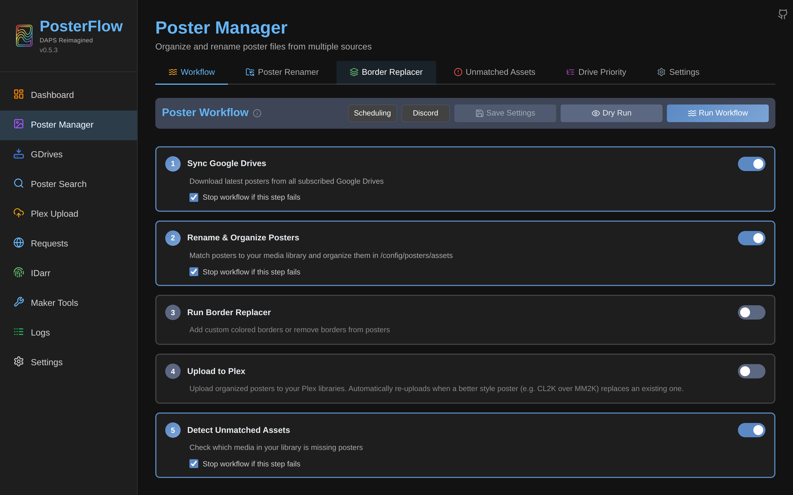
*Six tabs. Each tab has its own state. Switching tabs with unsaved changes triggers an `UnsavedChangesModal` to confirm discarding.*

## Workflow

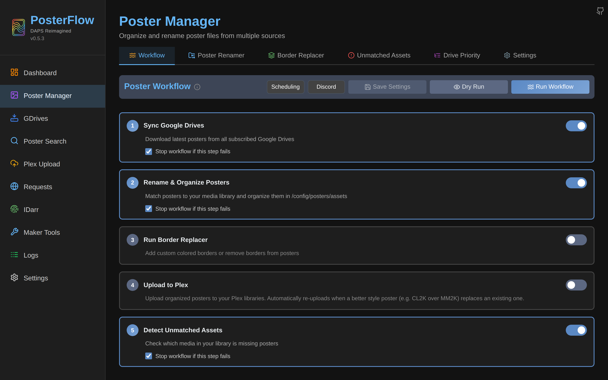

The Workflow tab is the "do everything for me" surface. It runs the following ordered pipeline as a single parent job (`job_type=Poster Workflow`), with the parent's progress sub-ranged across each step:

1. **Sync All** (0–20%) — calls `run_sync_all_job()`. Syncs every subscribed drive in sequence with rclone.
2. **Poster Renamer** (20–60%) — calls `run_rename_background_job()`. Reads from all synced drive folders, writes to `<destination>/tmp/` if "Auto-run Border" is on; otherwise directly to `<destination>/`.
3. **Border Replacer** (60–80%) — calls `run_border_replacer_background_job()`. Reads from `<destination>/tmp/`, writes to `<destination>/`.
4. **Unmatched Detection** (80–90%) — calls `run_unmatched_detection_background_job()`. Scans the destination, compares to Plex/Radarr/Sonarr inventories, writes a report to the `unmatched_assets_result` setting.
5. **Plex Upload** (90–100%) — only if enabled in the workflow config — calls `run_plex_upload_background_job()`. Uploads matched posters to Plex.

### Workflow controls

| Control | What it does |
|---|---|
| **Dry Run** | Passes `dry_run=true` through every step. Nothing is written to disk; nothing is uploaded. Logs report what would happen. The right way to validate matching before a destructive run. |
| **Rename Before Run** | If off, skips the renamer and runs Border on whatever's already in `<destination>/`. Off is the right setting for a re-border without rematching. |
| **Border Before Run** | If off, skips the Border Replacer entirely. |
| **Show IDarr in Workflow** | If on, adds IDarr steps for each enabled sync target. IDarr is documented below. |

The "global workflow lock" prevents two workflows running concurrently. The lock is released on completion or after 15 minutes — see [`troubleshooting.md`](troubleshooting.md#workflow-stuck) if a crashed workflow leaves the lock held.

### Discord summary

When the workflow finishes (success or failure), and if Discord is enabled with `workflow` events on, a workflow-summary embed is posted with one field per step. See [`notifications.md`](notifications.md).

## Poster Renamer

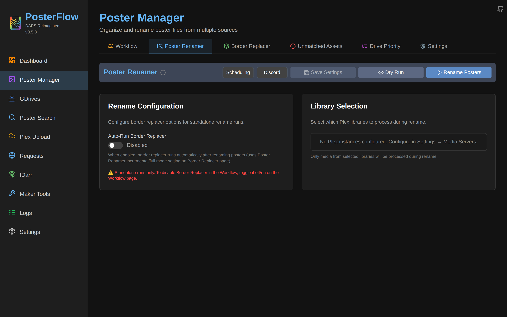

Inputs: every poster file in every subscribed drive's local cache (`/config/posters/gdrive/.../*`).

Outputs: organized files in the destination directory, in Kometa asset layout (`<destination>/<Title (Year)>/poster.jpg`, `Season01.jpg`, …).

### Matching algorithm

This is the core of PosterFlow. The exact algorithm, from [`backend/services/poster_renamer.py`](https://github.com/dweagle/posterflow/blob/develop/backend/services/poster_renamer.py):

1. **Gather assets** from every subscribed drive's local folder. Each filename is parsed by [`util/data/extract.py`](https://github.com/dweagle/posterflow/blob/develop/backend/util/data/extract.py) — year via regex `\((\d{4})\)`, IDs via `{tmdb-N}`, `{tvdb-N}`, `{imdb-ttN}`.
2. **Fetch media inventory** from every configured Plex/Sonarr/Radarr instance via [`util/arr/client.py`](https://github.com/dweagle/posterflow/blob/develop/backend/util/arr/client.py):
   - Plex: every **collection** in the selected libraries (`poster_renamer_libraries` setting filters to specific libraries; empty = all).
   - Sonarr: every series, with its monitored season list and episode counts. `/api/v3/series`.
   - Radarr: every movie. `/api/v3/movie`.
3. **Build a search index** in [`util/posters/index.py`](https://github.com/dweagle/posterflow/blob/develop/backend/util/posters/index.py) keyed by normalized title's first word's 3-char prefix and by `tmdb:N`/`tvdb:N`.
4. **For each asset, match in this order**:
   a. **Type check** — movie asset can only match a Radarr movie or a Plex movie collection; series asset can only match a Sonarr series. A "season poster" asset (filename contains `- Season NN`, `- Specials`, `_SeasonNN`) is treated as a child of its series.
   b. **ID match** (definitive): `tmdb_id`, then `tvdb_id`, then `imdb_id` from the asset filename matches the same field on a media item — the match is taken and no further fallback is attempted. For series, TMDB ID is skipped because Sonarr uses TVDB IDs.
   c. **Title match** (fallback): normalize both titles via `util/data/normalization.py` (strip year, HTML-decode, unidecode, drop ID tokens like `{tmdb-123}`, remove the words `(US)/(UK)/(AU)/(CA)/(NZ)/(FR)/(NL)/DC's`, convert `&` to `and`, strip illegal-for-filesystem characters `<>:"/\|?*`, strip common stopwords `the/a/an/and/or/but/in/on/at/to`, collapse whitespace, lowercase). Then check the normalized asset title against the search-index bucket for the normalized media title.
   d. **Variant title fallback**: titles like `The Lord of the Rings` get variant entries without the leading `The`; `Marvel Cinematic Universe Collection` gets a variant without `Collection`. Each variant is indexed and searched.
   e. **Season check** (series only): if the asset is a season poster, its season number must be in the matched media's `season_numbers` list.

5. **Rename and copy/move/hardlink/symlink** (per `poster_action_type` setting). For each matched item, the asset is written to `<destination>/<sanitized folder>/poster.<ext>` or `Season<NN>.<ext>`. The folder name is sanitized via the `pathvalidate` library to strip filesystem-illegal characters. If two assets resolve to the same destination path (e.g., the same drive has two posters for the same movie), the first match wins — duplicates are skipped with a warning.

6. **Change detection**: if the destination already has a file at the target path, `filecmp.cmp(src, dst, shallow=True)` checks size+mtime. If identical, the destination's mtime is sync'd from the source for the next run's stat-only check, and the file is **not** rewritten. If different, the new file replaces the old.

7. **Mark processed**: `posters.last_processed=now()` for every source file the job touched (matched or unmatched, copied or skipped). This is what lets the renamer be efficient on subsequent runs — unprocessed posters are prioritized, processed posters are stat-checked.

### Library filtering

The library selection picker (Settings → Media Servers → "Select Libraries" or directly in the Renamer tab) writes `poster_renamer_libraries` as a JSON array like `["Plex:Movies", "Plex:4K Movies"]`. The format is `<instance_name>:<library_key>`. Empty array = consider every library on every instance. Adding a library scopes the next match to just that library's collections (Plex) or all items (Sonarr/Radarr — `arr` instances don't have a library concept, just a per-instance opt-in).

### Auto-run Border

If the **Automatically run Border Replacer after Renamer** toggle is on, the renamer writes its output to `<destination>/tmp/` instead of `<destination>/`. The job then enqueues a Border Replacer job that consumes `tmp/` and writes back to `<destination>/`. This avoids serving half-rendered files to Plex/Kometa.

### Failure modes

| Symptom | Cause | Where to look |
|---|---|---|
| `Drive priority not configured` | `poster_drive_priority` is empty `{drive_ids:[], enabled_styles:[]}`. The renamer needs to know which drive wins on duplicates. | Poster Manager → Drive Priority. |
| `No assets found` | None of the subscribed drives have any files in their local cache. | Run Sync first. |
| `No media found` | All media-server connections failed or returned 0 items. | Test connections in Settings → Media Servers. |
| 99% of items go to Unmatched | Title normalization mismatch. Check the normalizer's stopword list. | Enable debug mode, look for `[MATCH]` entries in `poster_renamer.log`. |

### Expected runtime

On the test library used for these docs (1 subscribed CL2K drive with 0 posters), a renamer run completes in ~3 seconds. Representative real-world figure cited by the maintainer: a 50k-poster across 10 drives library matched against ~6,000 Radarr movies + 1,500 Sonarr series runs in ~8–15 minutes (varies with disk I/O and Plex collection enumeration). Use Dry Run to get a runtime estimate without writing anything.

### Idempotency

A second renamer run immediately after the first writes zero files (every destination matches its source via filecmp). The `last_processed` marker on `posters` rows also lets the renamer skip files it has already considered, so runs after the first are I/O bound on the source folder walk, not the matching.

## Border Replacer

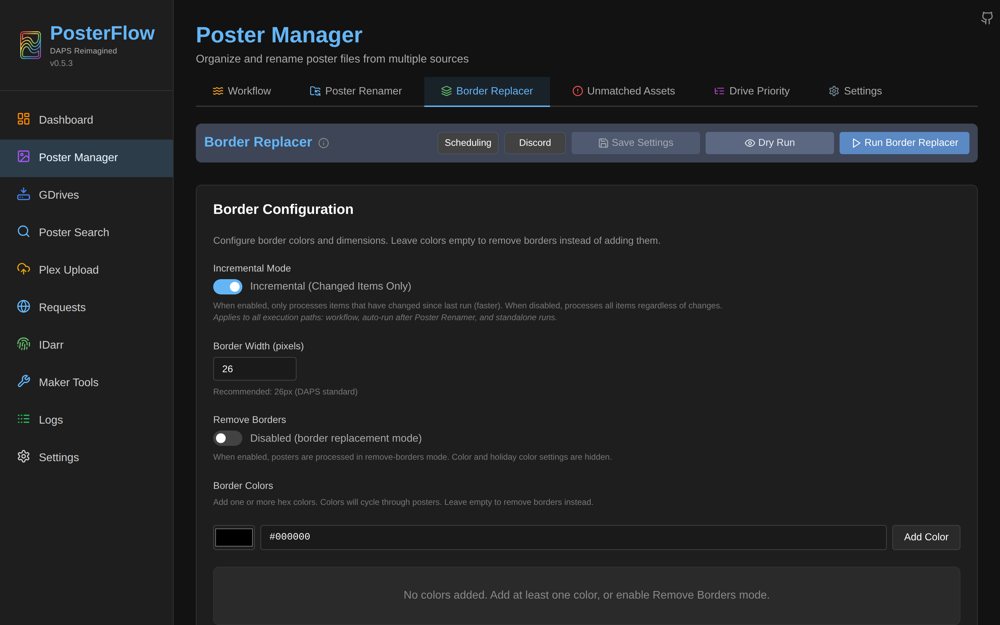

Reads from `<destination>/tmp/` (when chained after the renamer) or `<destination>/` (when run standalone). Writes to `<destination>/`. The transformation is byte-for-byte identical to DAPS — there is a `CRITICAL` comment block in the source code about the 1000×1500 resize that DAPS users depend on.

### Algorithm

For each image:

1. Open with Pillow.
2. **Add border mode** (`remove_borders=false`):
   - Crop `border_width` pixels off each side: `image.crop((bw, bw, w-bw, h-bw))`.
   - Create a new canvas of size `(cropped_w + 2*bw, cropped_h + 2*bw)` filled with the chosen color.
   - Paste the cropped image at `(bw, bw)`.
3. **Remove border mode** (`remove_borders=true`):
   - With `exclude=false`: crop top/left/right by `bw`, then add a black `bw`-tall band at the bottom.
   - With `exclude=true`: just crop all four sides by `bw`.
4. **Always**: resize the result to exactly `(1000, 1500)` and convert to RGB. This is what Plex and Kometa expect; do not change it.
5. Save to the destination. `filecmp` compares to any existing file first; if identical, the destination is left alone.

### Colors

`border_replacer_colors` is a JSON array of hex strings. Files are processed in scan order and the color is picked round-robin across the array — so a 5-color list applied to a 10-file run gives 2 of each. Short hex (`F00`) is expanded to `F00F00` before parsing.

### Holiday schedules

`border_replacer_holidays` is a JSON object like:

```json
{
  "Halloween": {
    "schedule": "range(10/01-10/31)",
    "colors": ["#FF6600", "#000000"]
  },
  "Christmas": {
    "schedule": "range(12/01-12/25)",
    "colors": ["#C8102E", "#006B3F"]
  }
}
```

The schedule format is literally `range(MM/DD-MM/DD)`, inclusive on both ends. On each border run, the current date is checked against every schedule; the first match wins and its colors override `border_replacer_colors`. If no schedule matches and `border_replacer_skip_non_holiday=true`, the job copies files through unchanged.

### Incremental mode

`border_replacer_mode=incremental` (default) skips files whose source mtime and size have not changed since the last processed run. The state is tracked in the `posters` table — internal rows with `drive_id="border_processed"` carry the last-known mtime/size per output file.

If the border settings themselves change (any of `border_replacer_colors`, `border_replacer_width`, `border_replacer_exclusions`, `border_replacer_remove_borders`), PosterFlow computes an MD5 hash of the settings dict, compares it to the previously-stored `border_replacer_settings_hash` setting, and on mismatch resets every `border_processed` row's mtime to 0 — forcing a full reprocess on the next run. This avoids leaving half the library with the old color scheme.

`border_replacer_mode=full` skips the change detection and re-processes everything regardless.

### Failure modes

| Symptom | Cause |
|---|---|
| `cannot identify image file` | The destination contains a non-image file. Check the source — a stray PSD or HEIC will trip the renamer too. |
| Container OOM during run | Very large source images. The `MALLOC_ARENA_MAX=2` + `malloc_trim` combo helps but won't save you from a 50 MB poster opened on a 256 MB container. Increase the container memory limit or downscale source assets. |
| All files marked "skipped" with no border applied | Settings hash hasn't changed and source mtimes haven't changed. This is correct behavior. Use `mode=full` to override. |

## Unmatched Assets

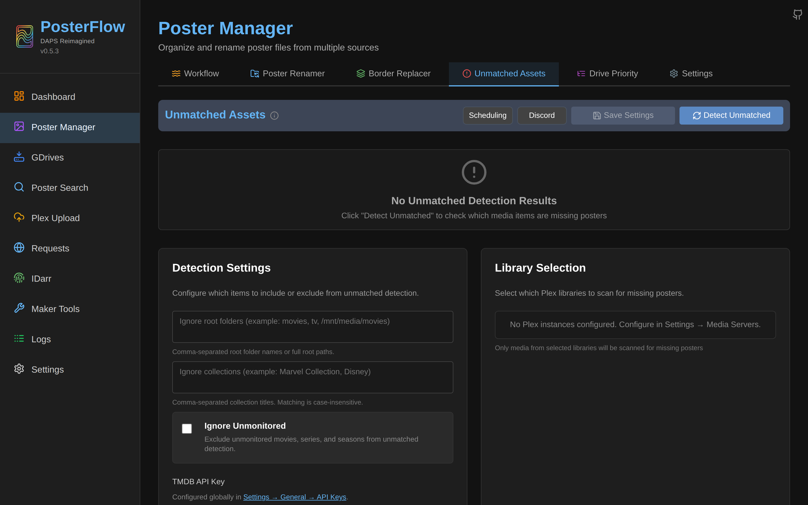

Scans the **destination** (not the source drives) and compares to your media-server inventory. The output is a report — JSON in the `unmatched_assets_result` setting, plus a downloadable CSV via "Download Full Report".

The job is *not* the inverse of the renamer. The renamer asks "what asset matches this Plex item?" — Unmatched asks "what Plex items have no asset?". An item can be missing from Unmatched (because it has a poster) but still mis-rendered (because the asset is the wrong style or wrong language); Unmatched does not check content, only existence.

### Algorithm

1. Build the search index from `<destination>/` (same prefix index as the renamer, but built over destination files).
2. For each Plex/Sonarr/Radarr media item that has a non-empty title and a "released"/"ended"/"continuing" status:
   - Skip if matches any pattern in `unmatched_ignore_root_folders`, `unmatched_ignore_collections`, or (if `unmatched_ignore_unmonitored=true`) if the item is unmonitored in Radarr/Sonarr.
   - Try TMDB-ID → TVDB-ID → IMDB-ID lookups against the asset index.
   - If no ID match: normalize title and search the prefix index.
   - For series: collect the season numbers of any matched asset folder and compare to the media's `seasons` — missing seasons are reported separately.
3. Roll up totals by type: movies / series / seasons / collections, with `total`, `unmatched`, and `percent_complete = 100 * (total-unmatched)/total`.
4. Persist the result in the `unmatched_assets_result` setting and emit a Discord notification if enabled.

### The unmatched list

For each unmatched item, the report includes the title, year, instance name, and (if the TMDB API key is configured) the TMDB URL: `https://www.themoviedb.org/<movie|tv>/<id>`. Use these links to find a poster on TPDb / Behind The Posters / etc., drop it into the matching community drive, and re-run.

If TMDB key isn't set, the modal shows a warning and the TMDB links are inactive.

### Downloading the report

The "Download Full Report" button writes a CSV with columns: `media_type, title, year, instance, tmdb_id, tvdb_id, imdb_id, status, root_folder, missing_seasons`. Useful input for downstream automation.

## Drive Priority

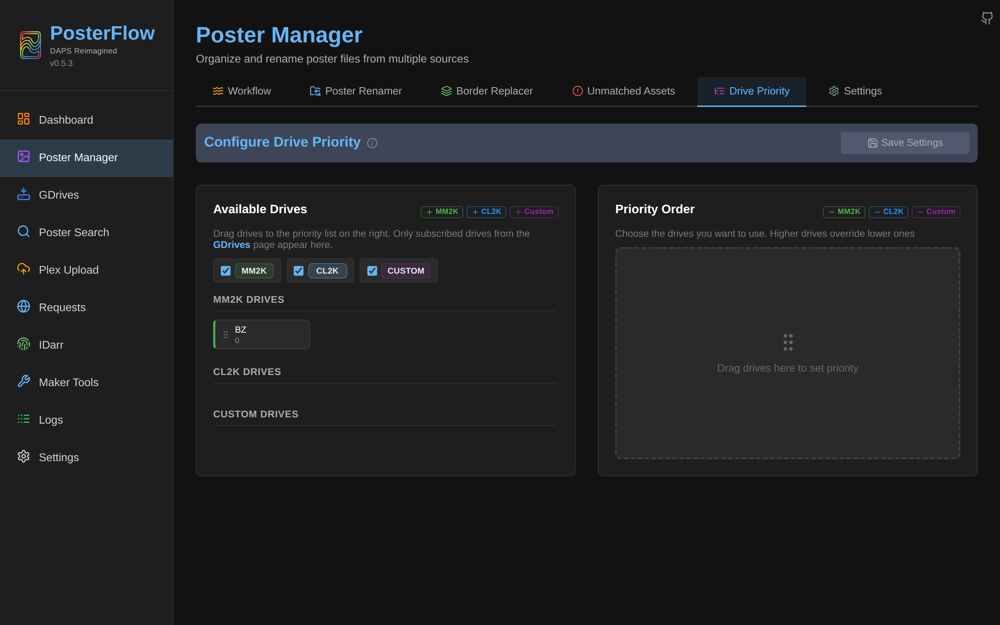

This tab is data only — it configures the renamer's behavior, it doesn't run a job. The "priority order" is the list the renamer walks when multiple drives have a candidate poster for the same media item. First match wins.

The tab persists `poster_drive_priority = {drive_ids: [int], enabled_styles: [str]}`. `drive_ids` is the ordered list (front of list = highest priority). `enabled_styles` whitelist limits the renamer to specific styles (e.g., `["MM2K"]` ignores CL2K and Custom artwork entirely).

Drag-and-drop UI:

- Left "Available Drives": every subscribed drive not yet in the priority list.
- Right "Priority Order": ordered list, drag within to reorder, drag back out to remove.
- Top "Enabled Styles": three checkboxes (CL2K / MM2K / Custom) — unchecked styles exclude those drives from match entirely, regardless of position in the order.

The renamer refuses to run if `poster_drive_priority.drive_ids` is empty. See [`troubleshooting.md`](troubleshooting.md#drive-priority-not-configured).

## Poster Manager Settings

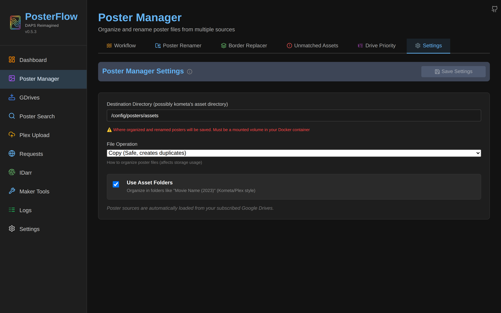

Local view of the same `poster_destination` and `poster_action_type` settings the wizard's Step 5 set. The four file-operation modes:

| Mode | Notes |
|---|---|
| `copy` | Default. `shutil.copy2` — preserves mtime. Safe; doubles disk usage relative to source. |
| `move` | Source file is removed after a successful write. **Destructive** — only use if your source drive really is a one-way pipeline. The next sync recreates the file, so this is rarely what you want. |
| `hardlink` | `os.link`. Source and destination share inodes — zero extra disk, but source and destination must live on the same filesystem. Common choice when `/config/posters/gdrive` and `/assets` are on the same volume. |
| `symlink` | `os.symlink`. Destination is a soft link to the source. Cross-filesystem-safe but the symlink target must be readable by Kometa/Plex — be careful with mount paths. |

## Plex Upload

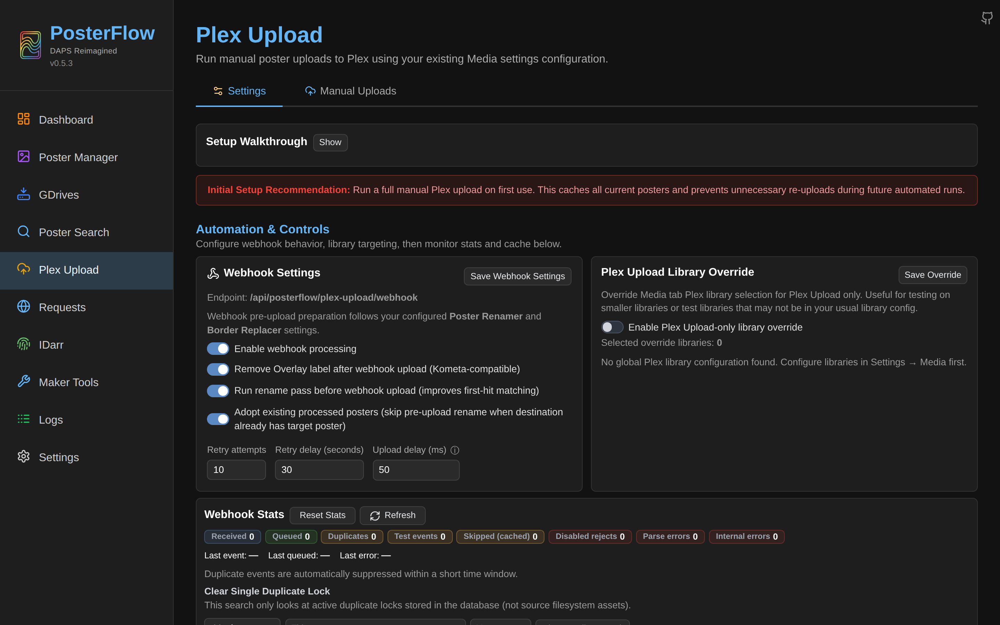

Two tabs: **Manual Upload** (form + one-click run) and **Automation Settings** (Radarr/Sonarr webhook config).

### Manual upload

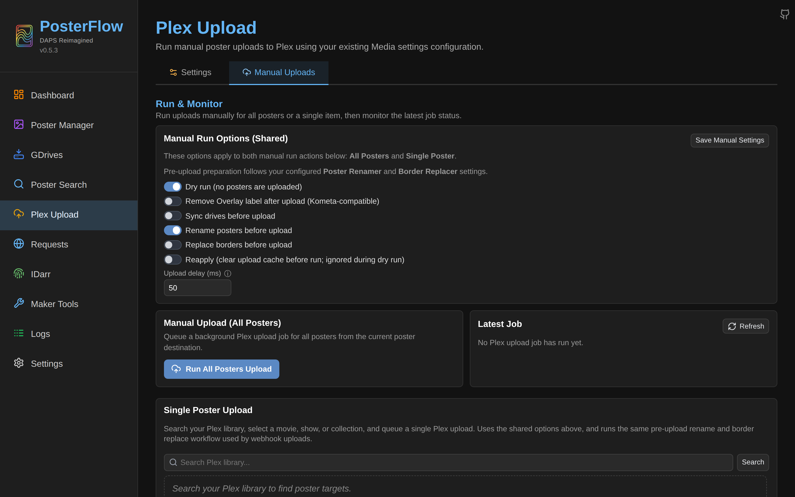

Walks the destination directory, matches each asset folder to a Plex item (by ID first, then title+year), POSTs the file to `/library/metadata/<rating_key>/posters` (Plex's poster upload endpoint), records the upload in the `plex_upload_records` SQL table.

Key behaviors:

- **Dry run** counts what would upload without POSTing anything.
- **Reapply** clears the upload cache for matching items first, forcing a re-upload even if mtime+hash haven't changed.
- **Remove Overlay Label** removes Kometa's `Overlay` label from the Plex item before upload — useful if Kometa's overlay label is preventing Plex from accepting a new poster.
- **Sync / Rename / Border Before Upload** queues the upstream jobs first, then uploads from the freshly-produced destination.

Skip logic: an upload is skipped if `plex_upload_records.file_mtime` matches the source file's mtime *and* `file_hash` matches a recomputed SHA-256. (Migration `0006_add_file_mtime_to_plex_upload_records.py` added the mtime column for a fast pre-check before computing the hash.)

### Webhook upload

The Automation Settings tab exposes a webhook URL like:

```
http://<your-host>:8357/api/posterflow/plex-upload/webhook
```

Configure Radarr (Settings → Connect → Webhook) and Sonarr to POST to this URL on these events: `Grab`, `Download`, `Upgrade`, `Rename`. PosterFlow parses the payload, finds the matching item, rename-then-uploads (if `rename_then_upload=true`), and records stats in the `webhook_stats` setting.

Deduplication: the webhook records a hash of `(source, event_type, media_type, title, year, season_number)` in an in-memory cache. Identical events within a short window are silently dropped — protects against Radarr's retry behavior.

Failure handling: `retry_attempts` (1–10) retries on transient failures with `retry_delay_seconds` (1–300) backoff. After all retries the job is marked failed and a Discord error notification fires (if enabled).

## IDarr

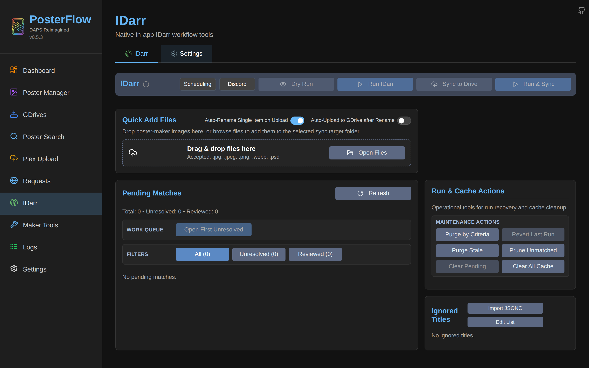

IDarr is for **poster makers**, not media consumers. It takes a directory of unidentified poster artwork (typically your raw output), figures out the TMDB/TVDB/IMDB IDs for each file, renames them into the canonical `Title (Year) {tmdb-NNN}.jpg` format, and optionally syncs the renamed files up to your personal Google Drive.

The two tabs:

| Tab | Purpose |
|---|---|
| **IDarr** | Drag-drop zone for uploading files, pending-match queue, run button. |
| **Settings** | Sync target configuration (label, personal drive ID, source folder), behavior toggles, cache controls. |

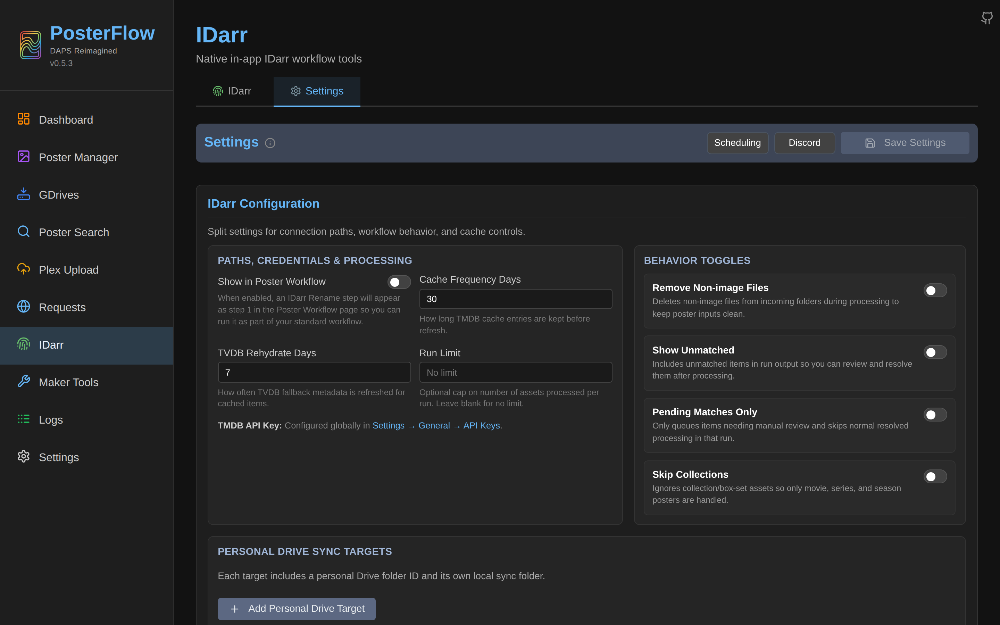

### Resolution chain

For each file in a sync target's source folder:

1. **Embedded ID** — if the filename already contains `{tmdb-N}`, `{tvdb-N}` or `{imdb-ttN}`, trust it and cache the result.
2. **TMDB API search** — rate-limited at min 100 ms between requests, max 3 retries on failures. Uses the global `tmdb_api_key` setting. The top match by title similarity is taken; the result is cached in `idarr_asset_cache` keyed by `<type>::<title>::<year>::scope=<token>`.
3. **Fuzzy match against cache** — if the API returns nothing, `difflib.SequenceMatcher` is used to find the best match among assets cached in the last 7 days.
4. **Pending review** — anything still unmatched after the API + fuzzy passes lands in the `idarr_pending_matches` table, surfaced in the UI for manual resolution.

### Rename and archive

After resolution, files are renamed to the canonical `<Type> {tmdb-N}.<ext>` format. Collisions (two files resolving to the same ID) are handled by archiving the older file to a `duplicates/` directory rather than overwriting it (introduced in 0.5.2 — see CHANGELOG).

### Sync to Google Drive

If "Force sync after run" is enabled on the IDarr Settings tab, a follow-up job uploads the renamed files via `rclone copy` (not `sync` — uploads add to the personal drive without deleting remote files PosterFlow didn't put there) to the configured personal Google Drive ID. This is what makes IDarr useful — it's the round-trip path from your raw artwork back into a shared community drive.

## Maker Tools

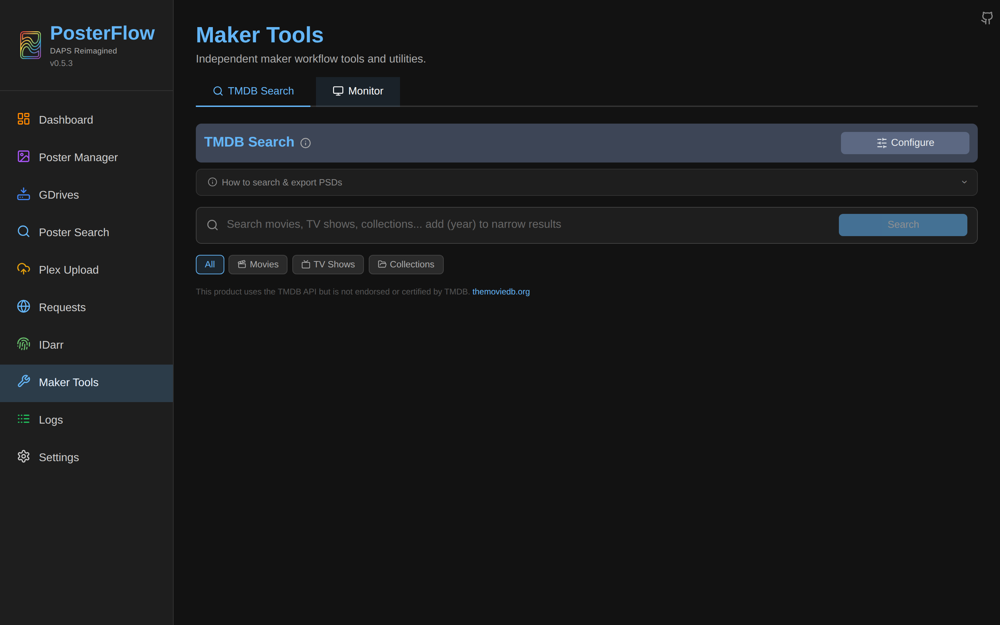

Two tabs.

### Monitor

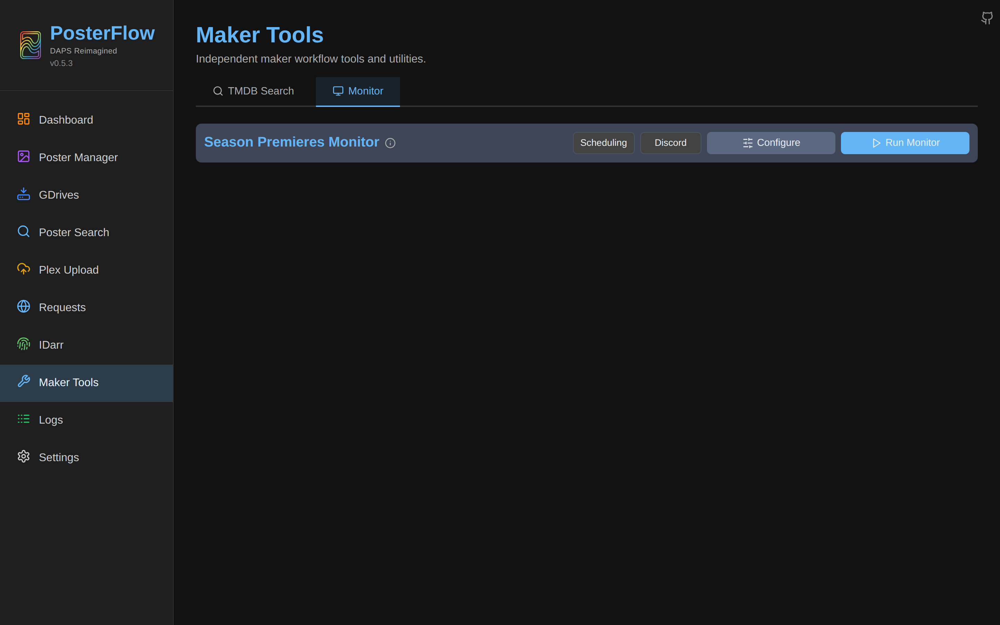

Scans upcoming and recent releases via the TMDB Discovery API on a schedule. The output is a list of titles a maker might want to make posters for. Configuration:

| Setting | Notes |
|---|---|
| Enable Monitor | Master switch. |
| Frequency (days) | How often the monitor job runs. |
| TVDB Frequency (days) | Same for TV (TMDB and TVDB are queried separately). |
| Limit | Optional cap on rows per scan. |

### TMDB Search


Manual search across TMDB, with Photopea integration for PSD editing. See the CHANGELOG entries for 0.4.0, 0.4.2, 0.4.3, 0.4.4 for the PSD workflow.

## Job-type table

Every distinct value the `jobs.job_type` column can hold, and what it maps to in the UI:

| job_type | Triggered by | Description |
|---|---|---|
| `Sync: <drive_name>` | GDrives → Sync, scheduler, webhook | Single-drive rclone sync. |
| `Sync All` or `Sync All (N drives)` | GDrives → Sync (N), scheduler | Sync every subscribed drive. |
| `gdrive_sync` | scheduler `job_type=gdrive_sync` | Same as Sync All, named for scheduler entries. |
| `Sync Group (CL2K)` / `Sync Group (MM2K)` / `Sync Group (Custom)` | scheduler `drive_group=...` | Sync every subscribed drive in one style. |
| `Poster Workflow` | Workflow tab, scheduler | Parent of the multi-step pipeline. |
| `Poster Renamer` | Renamer tab, scheduler, webhook | Standalone rename pass. |
| `Border Replacer` | Border tab, scheduler, post-renamer auto-run | Standalone border pass. |
| `Unmatched Detection` | Unmatched tab, scheduler | Standalone unmatched report. |
| `Plex Upload` | Plex Upload tab | Full library upload. |
| `Plex Upload Single` | Plex Upload tab → Single Item, scheduler | Single-item upload. |
| `Plex Upload Webhook` | Radarr/Sonarr webhook | Webhook-driven upload. |
| `idarr` | IDarr tab, scheduler | Identification + rename + (optional) drive upload. |
| `maker_monitor` | Maker Tools → Monitor, scheduler | TMDB discovery monitor. |

## Querying job state from outside the app

Useful curl commands for scripts and monitoring:

```bash
# Active jobs (anything pending or running)
curl -s -H "Authorization: Bearer <pwd>" http://localhost:8357/api/jobs/ | \
  jq '[.[] | select(.status=="running" or .status=="pending")]'

# Last 50 jobs of any kind
curl -s -H "Authorization: Bearer <pwd>" http://localhost:8357/api/jobs/

# Live job log file via download
curl -s -H "Authorization: Bearer <pwd>" \
  http://localhost:8357/api/job-logs/poster_renamer/poster_renamer.log/download \
  -o /tmp/last_renamer.log
```

Replace `Authorization: Bearer <pwd>` with the password set in Settings → Security; omit the header entirely if you haven't set a password (`backend/core/auth.py` lets unauthenticated requests through when `app_password_hash` is empty).
