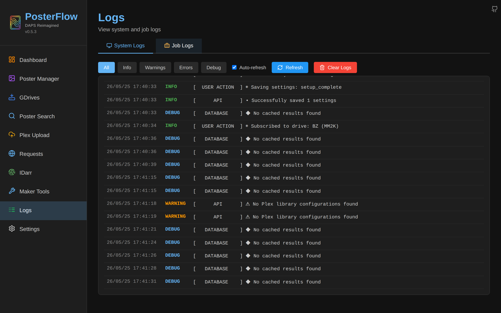
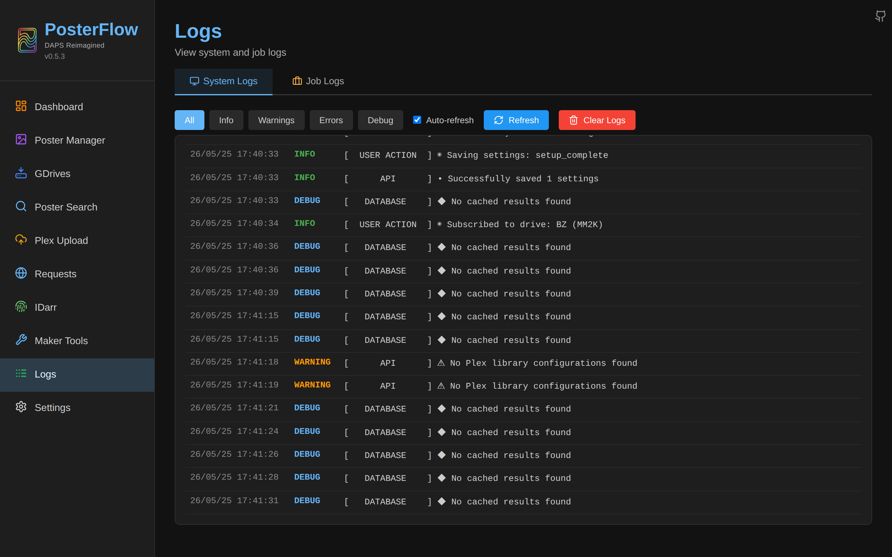
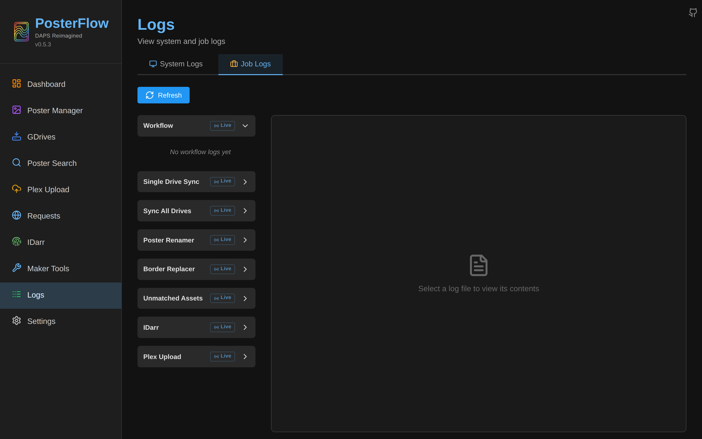

# Live Status

PosterFlow exposes three independent WebSocket endpoints for real-time UI updates. They are:

| Path | Pushed by | Consumed by |
|---|---|---|
| `ws://<host>:8357/api/jobs/ws` | DB poller in [`backend/api/jobs.py`](https://github.com/dweagle/posterflow/blob/develop/backend/api/jobs.py) | Dashboard's Active Jobs card, sidebar mini progress widget. |
| `ws://<host>:8357/api/logs/ws` | Loguru sink tailing `/config/logs/posterflow.log` ([`backend/api/logs.py`](https://github.com/dweagle/posterflow/blob/develop/backend/api/logs.py)) | Logs page → System tab. |
| `ws://<host>:8357/api/job-logs/{job_type}/live` | File tail of `/config/logs/<job_type>/<job_type>.log` ([`backend/api/job_logs.py`](https://github.com/dweagle/posterflow/blob/develop/backend/api/job_logs.py)) | Logs page → Job Logs tab → "View Live" button. |

All three are exempt from app-password auth: the middleware allowlists any path starting with `/ws` (`backend/core/auth.py` `_EXEMPT_PREFIXES`). If you front PosterFlow with auth at the reverse-proxy layer, make sure your auth allows WebSocket Upgrade — see [`reverse-proxy.md`](reverse-proxy.md).

The connection manager that backs all three lives in [`backend/core/websocket.py`](https://github.com/dweagle/posterflow/blob/develop/backend/core/websocket.py). Each endpoint has its own `WebSocketConnectionManager` instance with an `active_connections` list. The manager logs a `WebSocket` warning when an endpoint's connection count crosses 12 (`enter_threshold`) and logs an info line when it drops back below 8 (`exit_threshold`) — a coarse "your browser is leaking websockets" signal.

## Schemas

### `/api/jobs/ws`

The server polls the `jobs` table every `job_ws_poll_interval_active=0.2 s` while any job is active, dropping to `job_ws_poll_interval_idle=0.75 s` when idle (both are tunable via `Settings` class in `core/config.py`, neither is exposed in the UI).

On every poll, if the active-job payload has changed since the last send, the server pushes:

```json
{
  "jobs": [
    {
      "id": 42,
      "job_type": "Sync: BerserkeR",
      "status": "running",
      "progress": 37,
      "message": "Transferring poster.jpg (12/34)",
      "error": null,
      "started_at": "2026-05-25T17:42:11Z",
      "completed_at": null
    },
    {
      "id": 41,
      "job_type": "Sync All (12 drives)",
      "status": "completed",
      "progress": 100,
      "message": "Synced 12 drives: 247 added, 19 updated, 3 deleted",
      "error": null,
      "started_at": "2026-05-25T17:35:02Z",
      "completed_at": "2026-05-25T17:41:58Z"
    }
  ]
}
```

The payload includes:

- Every job currently in `running` or `pending` status.
- Every job that reached a terminal status (`completed` or `failed`) within the last 2 minutes — so clients reconnecting briefly still see the recent history without having to poll the REST API.

When the payload hasn't changed since the last send (no progress, no new jobs), the server sends a heartbeat every 30 seconds:

```json
{"heartbeat": 1748166000}
```

The number is a unix timestamp. Clients use it to detect dead connections — if no message arrives within ~45 s, the SPA reconnects.

### `/api/logs/ws`

Streams every Loguru record written to the application log file, level-filtered server-side. Two message types:

Log entry:
```json
{
  "timestamp": "2026-05-25T17:42:11Z",
  "level": "INFO",
  "message": "[    RCLONE     ] ✓ Sync completed: 247 files transferred"
}
```

Heartbeat (30 s):
```json
{"type": "heartbeat", "heartbeat": 1748166000}
```

The server seeks to the current end of `posterflow.log` on connect — historical entries are not replayed. To get historical entries, use `GET /api/logs/?lines=N` (max 1000).

Log rotation is detected via inode comparison: if the watched file shrinks or is replaced, the tail resets and a `reset` payload is sent — see the next endpoint's schema for the shape, the system-log endpoint uses the same convention.

### `/api/job-logs/{job_type}/live`

`{job_type}` is one of: `sync_one`, `sync_all`, `poster_renamer`, `border_replacer`, `unmatched_assets`, `plex_upload`, `workflow`, `idarr`, `maker_monitor`. The endpoint streams the file at `/config/logs/{job_type}/{job_type}.log`.

Four message types:

```json
// Initial dump on connect:
{"type": "content", "content": "…full current contents of the log file…"}

// Append-only update (file grew without rotation):
{"type": "append", "content": "…new lines since last send…"}

// Rotation detected (file shrank or inode changed):
{"type": "reset", "content": "…new contents from the start of the rotated file…"}

// Heartbeat every 30 s when nothing has changed:
{"type": "heartbeat", "heartbeat": 1748166000}
```

If the requested `{job_type}` is not a recognized job-type slug, the server closes with WebSocket code `4004` (custom code; clients should treat as a fatal "bad request").

## UI consumers


*The Logs page on first load. Two tabs at the top: System (default) and Job Logs.*


*The Logs → System tab subscribes to `/api/logs/ws` and renders each entry as a row. The toolbar has Auto-refresh, Follow Latest (auto-scroll), and Clear Logs controls.*


*The Job Logs tab lists log files under each job-type directory. Clicking "View Live" on a job opens a streaming pane backed by `/api/job-logs/<type>/live`.*

The Dashboard's Active Jobs card and the sidebar's mini progress widget both consume `/api/jobs/ws`. The sidebar version is rendered only while a job is running and only when you're **not** already on the Dashboard, so you don't see double progress bars.

## Consuming from a custom client

A minimal Python consumer for `/api/jobs/ws`, useful for `posterflow` → external dashboard integrations:

```python
import asyncio
import json
import websockets

async def watch():
    uri = "ws://posterflow.docs.local:8357/api/jobs/ws"
    async for ws in websockets.connect(uri, ping_interval=20, ping_timeout=60):
        try:
            async for raw in ws:
                msg = json.loads(raw)
                if "heartbeat" in msg and "jobs" not in msg:
                    continue
                for job in msg.get("jobs", []):
                    if job["status"] == "running":
                        print(f"[{job['job_type']}] {job['progress']}%: {job['message']}")
                    elif job["status"] == "failed":
                        print(f"FAILED: {job['job_type']}: {job['error']}")
        except websockets.exceptions.ConnectionClosed:
            await asyncio.sleep(2)  # Auto-reconnect via outer for-loop.

asyncio.run(watch())
```

Notes:

- Set `ping_interval` < 30 s so the client detects a dead connection faster than the server's heartbeat cadence.
- The endpoint does not accept any client-sent messages. Anything you send is silently dropped.
- There is no filter mechanism — every connected client gets every job's updates. If you need per-job subscriptions, filter client-side on `job_type`.

## Reverse proxy considerations

WebSocket upgrade requires the proxy to forward `Connection: Upgrade` and `Upgrade: websocket` headers untouched. The full set of working reverse-proxy snippets is in [`reverse-proxy.md`](reverse-proxy.md). The summary, copy-pasteable:

**Traefik v2/v3** (Docker labels) — websocket upgrade is automatic with the standard `http` entrypoint config, no extra middleware needed. Add the host's PosterFlow URL to `CORS_ORIGINS` if you're not using localhost.

**nginx** — the relevant `location` block must include:

```nginx
proxy_http_version 1.1;
proxy_set_header Upgrade $http_upgrade;
proxy_set_header Connection "upgrade";
proxy_read_timeout 86400s;  # Long enough to survive long syncs
```

Without `proxy_read_timeout` your idle WebSocket connections will close every minute and the UI will flap.

## Shutdown behavior

On `SIGTERM` / `SIGINT`, the FastAPI lifespan handler calls `shutdown_event.set()` immediately (before uvicorn starts its 3-second graceful-shutdown timer). This unblocks every WebSocket polling loop so they can close cleanly:

1. All three endpoints' polling loops check `shutdown_event.is_set()` between iterations and exit if set.
2. The lifespan then iterates `active_connections` for each manager and calls `ws.close()` on each.
3. Uvicorn proceeds with its normal graceful shutdown.

This pattern matters because uvicorn's default behavior is to `CancelledError` long-lived tasks at the graceful-shutdown timeout — which would surface as ugly stack traces. The custom `_ShutdownAwareServer` in `backend/main.py` lines 516–522 hooks `SIGTERM` early to make sure the websockets see the shutdown signal before the cancel.

## Connection pruning

`WebSocketConnectionManager.prune_stale()` runs on every poll iteration:

```python
def prune_stale(self) -> int:
    removed = 0
    for ws in list(self.active_connections):
        if (ws.client_state == WebSocketState.DISCONNECTED
            or ws.application_state == WebSocketState.DISCONNECTED):
            self.active_connections.remove(ws)
            removed += 1
    return removed
```

This catches the case where a browser tab is closed without a clean WebSocket close handshake — common when the user nav-aways. Without pruning, the `active_connections` list would grow unbounded across a long uptime.

## Debug and diagnostics

If you suspect the websocket isn't pushing what you expect:

1. Set `DEBUG=true` in compose, or toggle Debug from the Logs page. The connection manager logs every connect, disconnect, and threshold crossing at DEBUG level.
2. From the host, with the container running:

   ```bash
   docker logs posterflow 2>&1 | grep -iE '(websocket|connection)'
   ```

3. From a browser dev console on the Logs page, inspect the WebSocket frames panel — heartbeats every 30 s confirm the server is alive even when no log entries are flowing.

A common gotcha: if you've set up forward auth (Authelia, PocketID, etc.) at the proxy and the auth provider intercepts the Upgrade request, the WebSocket never opens and the UI silently shows empty job lists. Verify by hitting `/api/jobs/ws` directly with `wscat` or a Python client. See [`reverse-proxy.md`](reverse-proxy.md#forward-auth-compatibility).
