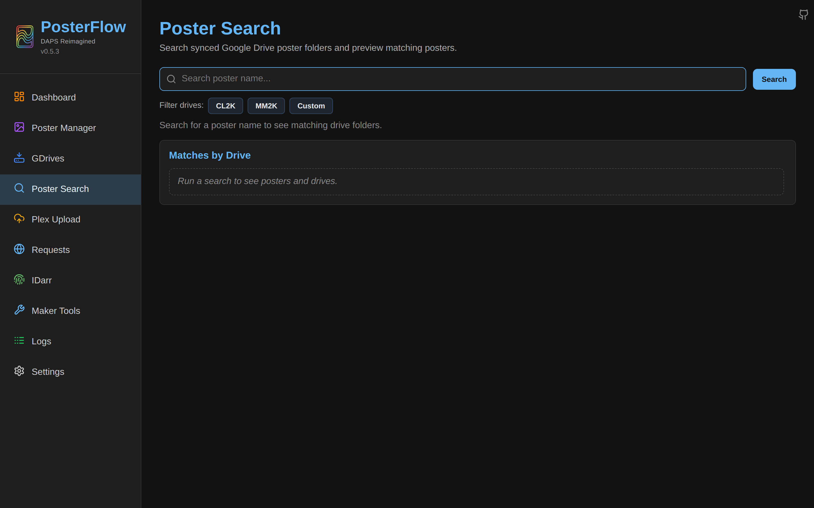
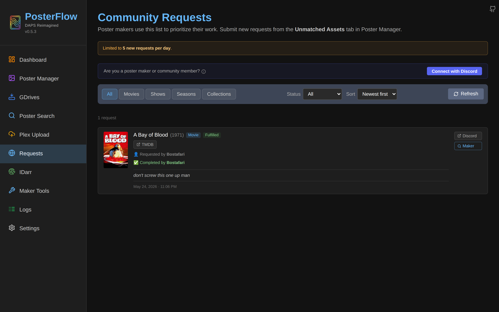
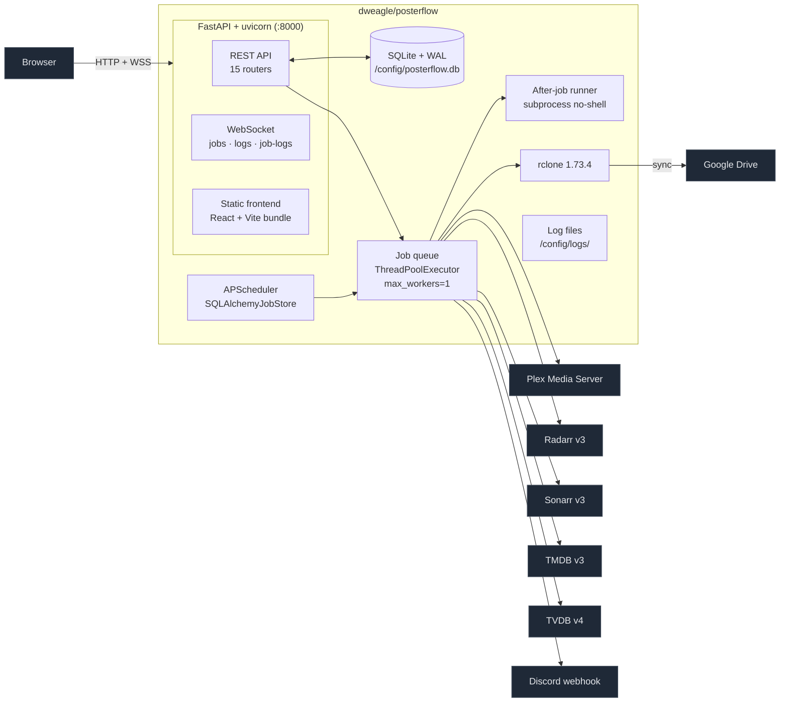

# Overview

PosterFlow is a self-hosted poster management application for Plex/Kometa homelabs. It pulls poster artwork from community-maintained Google Drive folders, matches each poster to the corresponding movie, show, season or collection in your Radarr/Sonarr/Plex libraries, normalizes the filenames into Kometa-compatible structure, optionally re-borders the artwork, and writes the result into your Kometa assets directory. It can also upload the matched posters directly to Plex.

The project is heavily inspired by [DAPS](https://github.com/Drazzilb08/daps) and reimplements a large portion of its workflow inside a single Docker container with a web UI, a job queue, a scheduler, a websocket-driven live status panel, and Discord notifications.

This documentation set covers deployment, configuration and day-2 operation for the `develop` branch at version 0.5.3.


*The dashboard immediately after first boot, with one community drive subscribed and no jobs run yet. The sidebar exposes every top-level surface; everything in this screenshot is described in the per-page docs linked below.*


*The Dashboard rendered at the documentation viewport size. The same composition as the hero above, captured at the standard documentation resolution for figure-by-figure comparison.*

## Beyond the dashboard

The other top-level surfaces, with one screenshot each:


*Poster Search — full-text search across every subscribed drive. Empty state until you start typing.*


*Community Requests — Supabase-backed user-request workflow with Discord OAuth for makers. Optional; deeper coverage in [`jobs.md`](jobs.md) and [`notifications.md`](notifications.md).*

## Who this is for

Two audiences are addressed in these docs:

- **Operators.** You run Plex, the *arrs and Kometa, you read logs, you reverse-proxy your homelab, and you want to deploy PosterFlow alongside the rest of your stack. Start with [`install.md`](install.md), [`reverse-proxy.md`](reverse-proxy.md), [`security.md`](security.md), [`backup-restore.md`](backup-restore.md) and [`troubleshooting.md`](troubleshooting.md).
- **Poster makers and power users.** You spend your time inside the UI subscribing to drives, tuning the renamer, polishing borders, and uploading to Plex. Start with [`setup-wizard.md`](setup-wizard.md), [`drives.md`](drives.md), [`jobs.md`](jobs.md), [`scheduler.md`](scheduler.md), [`notifications.md`](notifications.md) and [`live-status.md`](live-status.md).

[`configuration.md`](configuration.md) is the cross-cutting reference for every setting and environment variable. [`upgrade.md`](upgrade.md) covers the image-tag scheme and migration behavior. [`errata.md`](errata.md) lists known gaps and discrepancies between this documentation and the upstream README.

## What's in the container

The image is built in two stages from `Dockerfile`. The frontend is compiled with Vite into a static bundle; the backend is a FastAPI app on Python 3.12 that serves both the API and the bundled bundle from the same port. `rclone` 1.73.4 is copied in from the official rclone image. Everything else — APScheduler for the scheduler, SQLAlchemy + Alembic for the database, slowapi for rate limiting, Pillow + cairosvg for image processing, plexapi for Plex integration — is a Python dependency.



The frontend bundle is mounted at `/` and is configured as an SPA — any unrouted path falls through to `index.html` (see `backend/main.py` lines 482–498). The API lives under `/api/*` and the websockets under `/api/jobs/ws`, `/api/logs/ws`, and `/api/job-logs/{type}/live`. Both the bundle and the API listen on container port 8000; the canonical host-side port is 8357 (see [`install.md`](install.md)).

## How a poster gets from Google Drive to Plex

```mermaid
flowchart TD
  GD[Google Drive folder<br/>community preset or your own] -->|rclone sync<br/>--fast-list --tpslimit=8<br/>--size-only --no-update-modtime| Local[Local cache<br/>/config/posters/gdrive/&lt;style&gt;/&lt;drive&gt;/]
  Local -->|Poster Renamer<br/>match by ID then by normalized title| Tmp[/assets/tmp/ or /assets/]
  Tmp -->|Border Replacer<br/>crop, repaste, resize to 1000×1500| Assets[/assets/<br/>Kometa-compatible layout]
  Assets -->|Plex Upload<br/>per-item POST to /posters| PlexServer[Plex Media Server]

  Assets -.->|Unmatched Detection<br/>scans destination<br/>vs Plex libraries| Report[Unmatched report<br/>TMDB links per item]

  classDef stage fill:#1f2937,color:#e5e7eb,stroke:#4b5563;
  class Local,Tmp,Assets,Report stage;
```

The matching logic that drives this flow is documented per-job in [`jobs.md`](jobs.md). The output directory layout follows Kometa's asset conventions: one folder per movie or show, with `poster.jpg` for the main poster and `SeasonNN.jpg` for season posters.

## Relationship to DAPS

PosterFlow is "DAPS reimagined" — the byline in the sidebar is not aspirational, it is a description. The matching, border, and rename behaviors target byte-for-byte compatibility with DAPS for the same inputs (see the **CRITICAL** comments around the 1000×1500 resize in `backend/services/border_replacer.py`). What PosterFlow adds:

- A single web UI for everything, instead of a YAML-driven workflow.
- A scheduler with persistent jobs across restarts.
- A websocket-driven live status panel.
- Per-job Discord notifications with per-feature overrides.
- Webhook-driven uploads from Radarr and Sonarr.
- IDarr — TMDB/TVDB/IMDB ID assignment for poster-maker assets.
- Maker Tools — TMDB search, monitor pages for upcoming releases, optional Photopea integration for PSD editing.
- Community Requests — a Supabase-backed workflow for end-users to request posters; makers fulfill via Discord OAuth.

What PosterFlow does *not* do that DAPS does: it is not configured by YAML, it does not run as a standalone Python script, and it does not have a CLI.

## Theme

The UI ships dark-only. There is no light theme toggle in the codebase. Every screenshot in these docs is captured against the production CSS; do not be surprised when your install looks the same.

## Version under documentation

These docs describe `develop` at `VERSION=0.5.3`, captured against an image built locally from the `develop` branch on 2026-05-25. The instance used for screenshots ran with `DEBUG=true`, no media servers configured, no Google credentials configured (placeholder values were saved through the wizard so the captures could advance), and one community drive subscribed (`BZ`) so the dashboard would render a non-zero stat row.

> Note: where this documentation references a version-specific behavior, it links to the changelog entry that introduced it. If you are on `latest` rather than `develop`, check `CHANGELOG.md` for differences.
