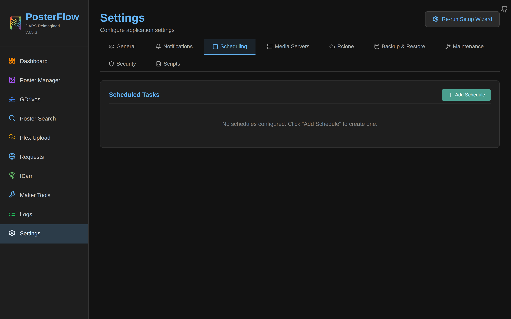
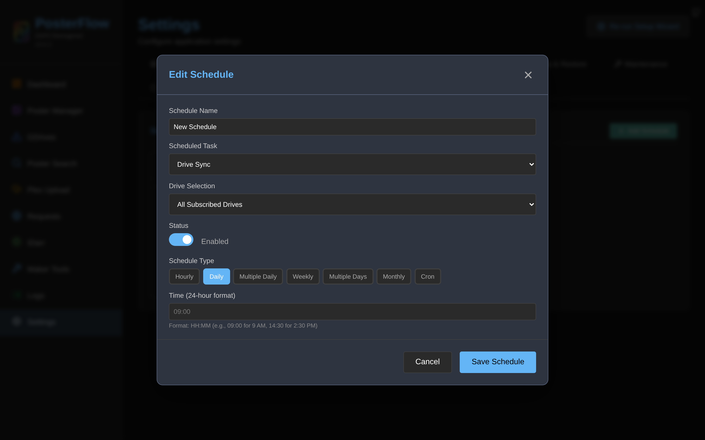
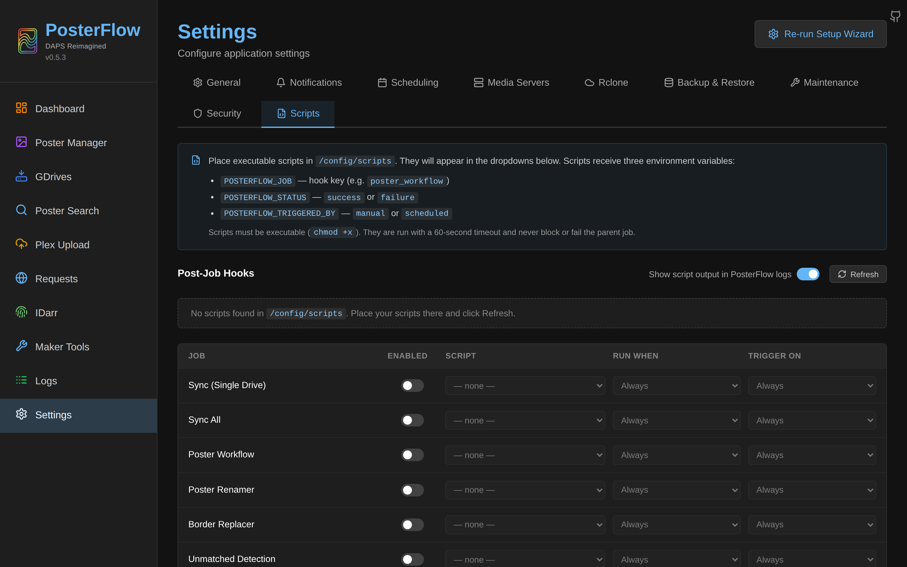

# Scheduler

The scheduler runs jobs on a cadence. It is implemented in [`backend/core/scheduler.py`](https://github.com/dweagle/posterflow/blob/develop/backend/core/scheduler.py) using **APScheduler 3.x** with a `SQLAlchemyJobStore` against the same SQLite database as the rest of the app. Schedules persist across restarts because APScheduler reads them from SQL on startup; no separate jobstore file is involved.

This page covers schedule semantics, the cadence formats accepted by the UI, the after-job script contract, and what happens when schedules overlap or fire after a restart.

## Scheduler configuration

From `backend/core/scheduler.py`:

```python
scheduler = BackgroundScheduler(
    jobstores={'default': SQLAlchemyJobStore(url=settings.database_url)},
    executors={'default': ThreadPoolExecutor(10)},
    job_defaults={'coalesce': True, 'max_instances': 3},
    timezone=get_localzone(),
)
```

What this means in practice:

- **Timezone**: every cron expression is interpreted in the container's local timezone (`tzlocal.get_localzone()`). Set `TZ` in your compose file ([`install.md`](install.md#environment-variables)) to the IANA name that matches your library's audience — `America/New_York`, `Europe/Berlin`, etc. If `TZ` is unset or `UTC`, schedules run on UTC. Changing `TZ` requires a container restart for existing schedules to re-anchor to the new local time.
- **Jobstore**: schedules live in the `apscheduler_jobs` table inside `posterflow.db`. PosterFlow also keeps its own row in the `schedules` table for the UI's metadata (name, drive scope, etc.); `update_schedules()` keeps the two in sync.
- **Coalesce**: when the container was down across multiple scheduled fires (e.g., a daily job and you were down for three days), APScheduler collapses those missed fires into a single run on startup. You do not get three back-to-back syncs.
- **Max instances**: the same scheduled job cannot have more than 3 instances pending simultaneously. Beyond that, fires are dropped. In practice this is hard to hit because the global job queue is `max_workers=1` — a slow job would have to take more than three full cycles to make new fires pile up.
- **Misfire grace time**: not explicitly set, so APScheduler's default of 1 second applies. A scheduled fire that doesn't get picked up by an executor within 1 s of its scheduled time is considered "misfired" and (because of coalesce) collapsed into the next run.

## The Schedule model and the UI


*Scheduling tab on a fresh install. Click "Add Schedule" to open the editor.*

Each row in the `schedules` SQL table is mapped to one or more APScheduler jobs. The columns:

| Column | Purpose |
|---|---|
| `id` | Primary key. |
| `name` | Free-form display name. |
| `job_type` | What this schedule fires. One of: `gdrive_sync`, `sync`, `poster_workflow`, `poster_renamer`, `unmatched_assets`, `border_replacer`, `idarr`, `maker_monitor`. (The `sync` value here triggers a single-drive sync; `gdrive_sync` is sync-all.) |
| `enabled` | Boolean. Disabled schedules stay in the table but are not registered with APScheduler. |
| `drive_id` | Foreign key to `drives`. Only meaningful for `sync` (single-drive). |
| `drive_group` | Style or IDarr scope. For sync jobs: `CL2K`, `MM2K`, `Custom`. For IDarr: `idarr_target_0`, `idarr_target_1`, … |
| `schedule_type` | One of seven cadence formats listed below. |
| `schedule_value` | Format depends on `schedule_type`. |
| `job_config` | JSON. Per-job-type extra config (e.g., workflow dry-run, renamer libraries override). |
| `last_run`, `next_run` | Timestamps. `next_run` is computed at read time from APScheduler's internal trigger. |

### Schedule types

Each schedule_type and its `schedule_value` format, taken from `backend/models/schedule.py`:

| `schedule_type` | `schedule_value` example | Meaning |
|---|---|---|
| `hourly` | `"15"` | Fire at minute 15 of every hour. Value is 0–59. |
| `daily` | `"14:30"` | Fire every day at 14:30 local. |
| `multiple_daily` | `"07:00,19:00"` | Fire multiple times per day, separately registered APScheduler jobs. |
| `weekly` | `"1:14:30"` or `"1:14:30,18:30"` | `<day>:<HH:MM>[,HH:MM,…]`. Day index uses Sunday-first (0=Sun, 6=Sat). APScheduler is Monday-first, but PosterFlow's `_to_apscheduler_day_of_week()` translates to weekday names to avoid off-by-one. |
| `multiple_days` | `"1:07:00,19:00\|5:09:00"` | Pipe-separated per-day expressions; each produces its own APScheduler job. |
| `monthly` | `"15:14:30"` | Day of month + time. Day must be 1–31; days beyond a month's actual length are silently skipped that month. |
| `cron` | `"0 9 * * 1-5"` | Full standard cron expression in five fields: `minute hour day_of_month month day_of_week`. Day-of-week is 0–6 with Sunday as 0 (the schema is `_to_apscheduler_day_of_week`-translated). |

The UI builds the right `schedule_value` for you — you don't normally hand-write these. Cron is the escape hatch for cases the structured pickers can't express.

### Adding a schedule


*The modal that opens when you click Add Schedule. Fields adapt to the chosen schedule type.*

The form, top to bottom:

1. **Name**: free-form. Shown on the Dashboard's Scheduled Tasks card.
2. **Task Type**: dropdown over the eight `job_type` values. Changing this resizes the form — e.g., picking `sync` reveals the drive picker; picking `idarr` reveals the sync-target picker.
3. **Scope picker** (only for `sync` and `idarr`):
   - For `sync`: a dropdown listing every drive in the DB, plus three group entries `All CL2K`, `All MM2K`, `All Custom`. Selecting a single drive sets `drive_id`; selecting a group sets `drive_group`.
   - For `idarr`: a dropdown listing each configured IDarr sync target as `idarr_target_<index>`.
4. **Schedule Type radio** + conditional fields per the table above.
5. **Enabled checkbox**.

On save, `POST /api/schedules/` runs validation: `job_type` must be in the allowed list, `drive_id` must reference an existing drive, `schedule_value` must parse for the chosen `schedule_type`. On a successful save, `update_schedules()` rebuilds the APScheduler job table — your schedule is live within the same request.

### Editing or deleting

Click any row in the schedule list to re-open the edit modal pre-filled. `PATCH /api/schedules/{id}` applies the update and re-registers the job. The delete button on each row removes both the SQL row and the APScheduler job; a confirmation modal prevents accidental deletes (added in 0.5.0, see CHANGELOG).

## Overlap behavior

The global job queue is single-threaded by default (`max_concurrent_jobs=1`). A scheduled fire that arrives while another job is running is **queued**, not dropped. The dashboard's Active Jobs card shows the queue depth.

Within APScheduler itself:

- The same scheduled job can have up to 3 queued instances (`max_instances=3`). Beyond that, APScheduler logs `Skipped: maximum number of running instances reached` and drops the new fire. This only happens if your global job queue is so backed up that three full cycles of the same schedule have piled up.
- `coalesce=True` collapses missed fires into one. After a 24-hour container outage, a daily schedule fires once, not 24 times.
- After a restart, every persisted schedule re-registers automatically. Any fires missed during the outage that fall within `misfire_grace_time` (1 second by default) fire immediately; older missed fires are coalesced or dropped per the rules above.

## Chaining jobs

There is no native "if A succeeds, then run B" chaining. The Workflow job type ([`jobs.md`](jobs.md#workflow)) is one fixed pipeline; to chain anything else, use the **after-job script** hook (below) to invoke whatever you want via the API. Common pattern: a daily Workflow at 04:00, a separate weekly Unmatched Detection on Sundays at 05:00.

## After-job scripts

The Settings → Scripts tab and the `post_job_hooks` setting let you run a script after a job finishes. Implementation: [`backend/core/hooks.py`](https://github.com/dweagle/posterflow/blob/develop/backend/core/hooks.py).


*Six hook points are exposed. Each row maps to one job type.*

### Hook points

Six hook keys, mirroring the major job types:

| Key | Fires after |
|---|---|
| `sync_one` | Single-drive sync (`Sync: <name>`). |
| `sync_all` | All-drives sync (`Sync All`, `gdrive_sync`). |
| `poster_workflow` | The Workflow pipeline. |
| `poster_renamer` | A standalone renamer run. |
| `border_replacer` | A standalone border run. |
| `unmatched` | Unmatched detection. |

The workflow's sub-steps **do not** fire their own hooks — only the parent workflow hook fires. This is intentional so a Workflow run doesn't run six scripts.

### Configuration per hook

Each hook has four fields, persisted as JSON in the `post_job_hooks` setting:

| Field | Type | Effect |
|---|---|---|
| `enabled` | bool | Master switch. |
| `script` | filename | The script to run, relative to `/config/scripts/`. The dropdown lists only files in that directory that are executable (`os.access(path, X_OK)`). |
| `run_when` | enum `always` / `scheduled` / `manual` | If `scheduled`, the hook only fires for jobs whose `triggered_by="scheduled"`. If `manual`, only for `triggered_by="manual"`. |
| `trigger_on` | enum `always` / `success` / `failure` | Conditional on the job's outcome. |

### Script execution contract

When a hook fires, PosterFlow runs:

```python
subprocess.run(
    [str(script_path)],     # NO shell=True
    timeout=60,
    capture_output=True,
    text=True,
    env={
        "POSTERFLOW_JOB": hook_key,            # "sync_one", "poster_workflow", etc.
        "POSTERFLOW_STATUS": "success"|"failure",
        "POSTERFLOW_TRIGGERED_BY": "manual"|"scheduled"|"workflow",
        "HOME": os.environ.get("HOME","/root"),
        "PATH": "/usr/local/sbin:/usr/local/bin:/usr/sbin:/usr/bin:/sbin:/bin",
    },
)
```

| Property | Value |
|---|---|
| Working directory | Inherited (`/app` in the container). |
| Environment | **Not** inherited. Only the four POSTERFLOW_* vars plus HOME and PATH are passed. |
| Stdin | Closed. |
| Stdout / Stderr | Captured. If `hooks_script_logging=true` (default), every non-empty stdout line is logged at INFO, stderr at INFO on success or WARNING on non-zero exit. |
| Timeout | 60 seconds. A timed-out script is killed; the job itself is unaffected. |
| Exit code | Non-zero is logged with the stderr; the job is **not** retroactively failed. Hooks are best-effort. |
| Working user | `posterflow` (UID/GID = `PUID`/`PGID`). |
| Shell | None. The script must have a valid shebang line (e.g., `#!/bin/bash`). |

### Validation before execution

`_validate_script()` in `backend/core/hooks.py` rejects:

- Path separators or `..` in the filename — only basenames inside `/config/scripts/` are accepted.
- A script that doesn't exist or is not a file.
- A script that isn't executable (`chmod +x` is required).
- A script with CRLF line endings — the error message tells you to run `sed -i 's/\r//' /config/scripts/<name>`.

Failures of validation produce a log warning and the hook is silently skipped; the parent job's status is unaffected.

### Security implications

A hook script is **arbitrary code execution inside your PosterFlow container**, running as the `posterflow` user. Anyone who can write to `/config/scripts/` can run anything they want when a job completes. In a homelab the standard assumption is that you own `/config` end-to-end and only you put scripts there. If you share PosterFlow with non-trusting users, do not expose Settings → Scripts via reverse proxy without app-level auth. See [`security.md`](security.md#after-job-scripts).

### Example script

A common workflow: poke Kometa to re-scan its asset library after a Workflow run.

```bash
#!/bin/bash
# /config/scripts/refresh_kometa.sh
# chmod +x /config/scripts/refresh_kometa.sh

# Only run on success.
if [ "$POSTERFLOW_STATUS" != "success" ]; then
    exit 0
fi

# Tell Kometa to do an asset-only refresh on its next loop.
curl -sf -X POST "http://kometa.docs.local:8000/refresh-assets" \
    -H "Authorization: Bearer ${KOMETA_TOKEN:-}" \
    || echo "Failed to notify Kometa (continuing anyway)" >&2
```

With `trigger_on=success` and `run_when=scheduled` configured for the `poster_workflow` hook, this fires only after a successful nightly workflow. The `KOMETA_TOKEN` env var is **not** passed in because PosterFlow strips the parent environment — you'd need to bake the token into the script or fetch it from a file the script reads.

## Logging script output

`hooks_script_logging` (Settings → Scripts, default `true`) controls whether stdout from scripts is captured into PosterFlow's application log. Disable it if your scripts are chatty and you don't want them filling up `/config/logs/posterflow.log`. Errors (non-zero exit) are still logged at WARNING regardless.

## Querying schedules from outside the app

```bash
# List all schedules
curl -s -H "Authorization: Bearer <pwd>" http://localhost:8357/api/schedules/

# Filter to one job type
curl -s -H "Authorization: Bearer <pwd>" "http://localhost:8357/api/schedules/?job_type=poster_workflow"

# Available script names (read-only)
curl -s -H "Authorization: Bearer <pwd>" http://localhost:8357/api/scripts/available
```

The list endpoint returns `next_run` computed from APScheduler's in-memory state — this is a useful sanity check that the scheduler actually has the job registered, not just the DB row.
