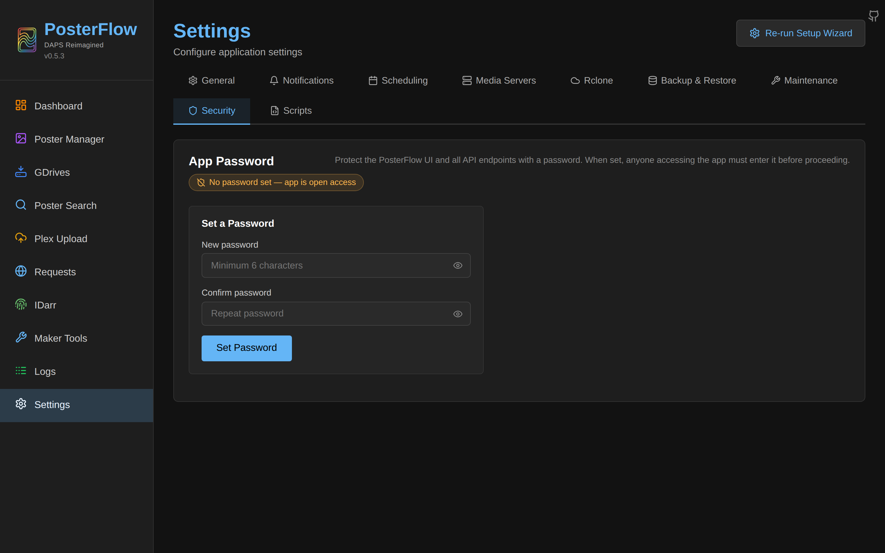

# Security

PosterFlow is a homelab tool. Its threat model is "trusted operator on a trusted LAN, possibly fronted by a forward-auth gateway." It is not hardened for multi-tenant or hostile-internet deployment. Read this page before you expose it publicly.

## What PosterFlow protects against

- **CSRF on browser API calls**: the FastAPI CORS middleware does not allow credentialed cross-origin requests (`allow_credentials=False`), and the app password is a Bearer-token header, not a cookie. A malicious site can't make an authenticated request from your browser.
- **Command injection in rclone / scripts**: rclone is invoked with `subprocess.Popen(argv_list)`, never `shell=True`. After-job scripts are invoked the same way. Filenames passed to either are validated against patterns that reject `..`, `/`, control chars, and (for scripts) anything outside `/config/scripts/`.
- **Path traversal in backup restore**: each zip member is resolved and checked with `is_relative_to(safety_dir)` before extraction. Zip-slip attempts log a warning and abort the restore.
- **Path traversal in poster image streaming**: `GET /api/stats/posters/{id}/image` resolves the file path and confirms it lives inside the drive root before serving it.
- **SSRF on Plex thumbnail proxy**: `GET /api/posterflow/plex-upload/plex-thumb` validates that the `key` parameter starts with `/` and contains no `://`, `@`, or control characters before composing the Plex URL.
- **Secrets in `ps aux` / `/proc/<pid>/cmdline`**: rclone OAuth credentials are written into `/config/rclone.conf` instead of being passed as command-line arguments. A user with `ps` access on the container's PID namespace sees only `rclone sync gdrive,root_folder_id=...:` and the local path, never the client secret or token.
- **Constant-time password comparison**: `secrets.compare_digest` is used in `verify_password` to defeat timing attacks against the app password.

## What PosterFlow does **not** protect against

- **No auth by default.** Out of the box, every API call works without credentials. The app password must be opted into (Settings → Security → set password). Even with a password set, all websockets and a handful of read-only endpoints (`/api/health`, `/api/version`, `/api/version/update`, `/api/auth/*`) are exempt — those endpoints leak version info and trigger a Discord test on a known webhook URL.
- **No mTLS, no OIDC, no SAML.** If you want federated auth or certificates, front it with a proxy that does — see [`reverse-proxy.md`](reverse-proxy.md#forward-auth-compatibility).
- **No multi-user model.** There is one app password and one set of permissions. Two operators sharing the URL are indistinguishable in the logs.
- **No audit log.** Some `[USER_ACTION]` entries appear in `posterflow.log` for things like drive subscribe/unsubscribe, but it's not a tamper-evident audit log.
- **After-job scripts are arbitrary code execution by design.** Anyone with write access to `/config/scripts/` can run anything when a job completes. See [`scheduler.md`](scheduler.md#after-job-scripts).
- **The Maker Tools Photopea integration accepts callbacks from `https://www.photopea.com`.** This is a CORS allowance, not an exploit, but it's a deliberate cross-origin trust. Removing the Photopea origin from `CORS_ORIGINS` disables the feature.
- **`/api/posterflow/plex-upload/webhook` accepts unauthenticated POSTs.** Anyone who can reach the webhook URL can trigger an upload. The dedupe cache prevents most accidental floods but a malicious actor with the webhook URL can cause real work. Either keep the URL secret, or front the webhook path with proxy-level auth that bypasses for trusted source IPs (your Radarr/Sonarr boxes).

## App password



Set a password at Settings → Security or via `POST /api/auth/set`. The password is:

1. Salted with 32 random bytes from `secrets.token_bytes(32)`.
2. Hashed with PBKDF2-HMAC-SHA256, **260,000 iterations**.
3. Salt and hash both stored as hex strings in the `settings` table (`app_password_salt` and `app_password_hash`).
4. Cached in memory for 5 seconds (`_CACHE_TTL` in `core/auth.py`) so the middleware doesn't hit SQL on every request.

The plaintext password never touches disk and is never returned by any API.

### How the middleware decides

For each `/api/*` request (and only `/api/*` — the SPA bundle is served before the middleware runs):

1. If the path is in `_EXEMPT_PATHS` or starts with one of `_EXEMPT_PREFIXES` (`/api/auth/`, `/ws`), pass through.
2. Look up the current password hash from the 5-second TTL cache.
3. If no password is set: pass through. Auth is opt-in.
4. Extract the `Authorization: Bearer <token>` header. If missing or malformed, respond `401 Unauthorized`.
5. PBKDF2-hash the token with the stored salt; constant-time compare to the stored hash. On mismatch: `401 Unauthorized`.
6. On match: pass through. No session cookie is set, no token rotation — every request includes the bearer header.

### Why no JWT / session cookie

Two reasons: (1) the threat model doesn't justify the complexity, (2) WebSockets cannot send custom headers from a browser, so a Bearer-only design simplifies the always-exempt WS path. The SPA stores the password in `sessionStorage` and re-attaches it to every fetch.

### Disabling the password

Settings → Security → "Remove Password" calls `POST /api/auth/clear` with the current password as proof. Empty strings are written to both keys; on the next 5-second cache refresh the middleware reverts to open access.

### Rate limiting

`/api/auth/verify` and `/api/auth/set` are rate-limited via slowapi to **10/minute per IP** (`backend/core/rate_limiter.py` and the `@limiter.limit("10/minute")` decorators on those endpoints). At 10 attempts per minute with the 260k-iteration PBKDF2 cost, brute-forcing a 12-character random password is multi-millennium even before the IP is blocked by the proxy.

`get_remote_address()` uses the direct peer's IP. If you front PosterFlow with a proxy on `127.0.0.1`, every login attempt looks like it's from the proxy and the rate limit becomes shared across all your users. Add per-user rate limiting at the proxy if you care about this.

## Sensitive data on disk

| File / path | Content | Format | Owner |
|---|---|---|---|
| `/config/posterflow.db` | App password (hashed+salted), TMDB API key, Plex tokens, Radarr/Sonarr API keys, Discord webhook URL, Google service-account JSON file path | SQLite; secrets stored as plaintext **values** (except the app password, which is hashed). | `posterflow:posterflow` (UID/GID from PUID/PGID). |
| `/config/rclone.conf` | Google OAuth client ID + secret + refresh token, **or** the service-account file path. | INI file. Values are plaintext. | Same. |
| `/config/service_accounts/*.json` | Google service-account private keys (RSA). | Plaintext JSON. | Same. |
| `/config/posterflow.db-wal` / `-shm` | Same as the DB, in WAL form. | SQLite. | Same. |
| `/config/logs/*.log` | App log. Secrets are **not** logged in cleartext — settings reads use the masked API. | Plaintext. | Same. |

Anyone with read access to `/config/posterflow.db` can extract every API key and webhook URL in cleartext. The SQLite DB is not encrypted at rest. The standard mitigation is to control file ownership at the host: `chown -R <PUID>:<PGID> /srv/posterflow/config && chmod 700 /srv/posterflow/config`. Within the container, the `posterflow` user owns everything and other users have no read access.

The **API** returns sensitive values as `***masked***` from `GET /api/settings/` (see `SENSITIVE_PLAIN_KEYS` and `SENSITIVE_JSON_KEYS` in `backend/api/settings.py`). Revealing the underlying value requires hitting `POST /api/settings/reveal` with the specific key — which is gated by the app password if set. Sensitive JSON fields (e.g., `plex_instances[].api_key`) are masked individually.

The `app_password_hash` and `app_password_salt` are in `NON_REVEALABLE_KEYS` — even the reveal endpoint refuses to return them.

## File permission expectations

The container starts as root, then `entrypoint.sh` remaps the `posterflow` user to `PUID:PGID` and `chown`s `/config` to it. From that point on, the app process never runs as root.

If your `/config` mount has files owned by a different UID (e.g., you restored from a backup taken on another host), the entrypoint cannot fix them — `chown /config` only changes the top-level mount point. You'll see warnings in the logs like `Permission denied` when the app tries to write into a subdirectory owned by the wrong UID. Fix this by running `chown -R <PUID>:<PGID> /srv/posterflow/config` on the host before restarting.

The other two mounts (`/assets`, `/idarr`) are not `chown`'d by the entrypoint. PosterFlow opens them with the `posterflow` user's UID; if the host directory is owned by `root:root` (a common default), writes will fail. Set the host directory's ownership to match `PUID:PGID`.

## CORS

PosterFlow's CORS middleware:

```python
allow_origins=settings.get_cors_origins(),     # exact match list
allow_credentials=False,                       # cookies never sent cross-origin
allow_methods=["*"],
allow_headers=["*"],
```

`allow_credentials=False` is the critical setting — it means the browser will not attach the user's session cookies to cross-origin requests, so a malicious site cannot make an authenticated request that piggybacks on your PosterFlow session.

The allowlist itself is the `CORS_ORIGINS` env var (default localhost ports + Photopea). Adding a hostile origin to this list is a foot-gun; only add origins you trust.

## Network egress

PosterFlow needs outbound TCP to:

| Destination | Port | Purpose |
|---|---|---|
| `raw.githubusercontent.com` | 443 | Community drive preset list. |
| `api.github.com` | 443 | Version-update check (`get_version_update_status`). |
| `*.googleapis.com` / `*.google.com` | 443 | rclone Drive API. |
| `api.themoviedb.org` | 443 | TMDB lookups (Unmatched, IDarr, Maker Tools). |
| `image.tmdb.org` | 443 | Poster previews in the UI and Maker Tools. |
| `api.thetvdb.com` | 443 | TVDB lookups (IDarr, Maker Tools). |
| `discord.com` / `discordapp.com` | 443 | Outbound webhook posts. |
| `<your Plex URL>` | as configured | Plex API and poster upload. |
| `<your Sonarr/Radarr URL>` | as configured | Sonarr/Radarr API. |
| `cdn.jsdelivr.net` | 443 | The Discord embed spacer image. Not required for app function. |
| Your Supabase project | 443 | Community Requests (only if enabled). |

If you restrict egress (e.g., via a Docker network or firewall), allowlist the relevant subset.

## After-job scripts

The hook system explicitly runs arbitrary code in the container. See [`scheduler.md`](scheduler.md#after-job-scripts) for the contract.

The implications:

- Write access to `/config/scripts/` is equivalent to code execution as the `posterflow` user inside the container.
- The `posterflow` user can read every file in `/config`, which includes `rclone.conf` and `posterflow.db` — so a script can extract every secret PosterFlow knows about.
- The script gets a clean environment (only `POSTERFLOW_*`, `HOME`, `PATH`) so secrets are not casually leaked into child processes via env vars.
- A 60-second timeout limits runaway scripts but does not constrain memory or CPU.

In a hostile-tenant scenario, disable the hooks UI by removing the Settings → Scripts tab from your forward-auth allowlist or by deleting `/config/scripts/` entirely. There is no in-app setting to disable the hook subsystem.

## Backup contents and trust

The backup zip (Settings → Backup & Restore → Download Backup) includes:

- `posterflow.db` — every secret PosterFlow stores, including hashed app password.
- `rclone.conf` — OAuth client ID, secret, refresh token.
- `drives_cache.json` — public information; no secrets.
- `metadata.json` — version and timestamp; no secrets.

Treat backup files exactly the same as you would a `.env` file or a private SSH key: encrypted at rest, transferred over secure channels. PosterFlow itself does not encrypt the zip. See [`backup-restore.md`](backup-restore.md).

## Reporting

If you find a security issue, follow the project's reporting conventions in the upstream README at [github.com/dweagle/posterflow](https://github.com/dweagle/posterflow). At the time of this writing the project does not advertise a SECURITY.md or a security contact email — file a GitHub issue and the maintainer will route it.
