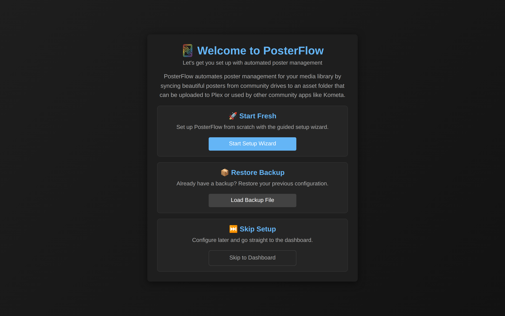
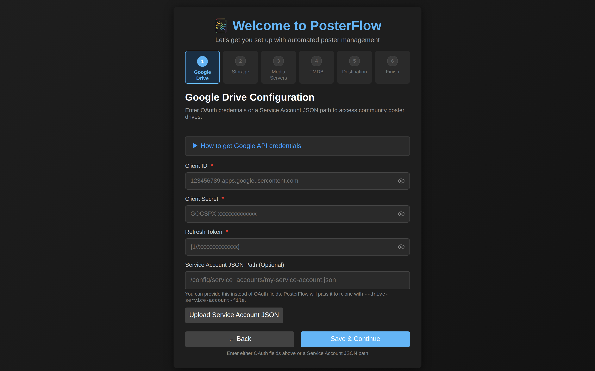
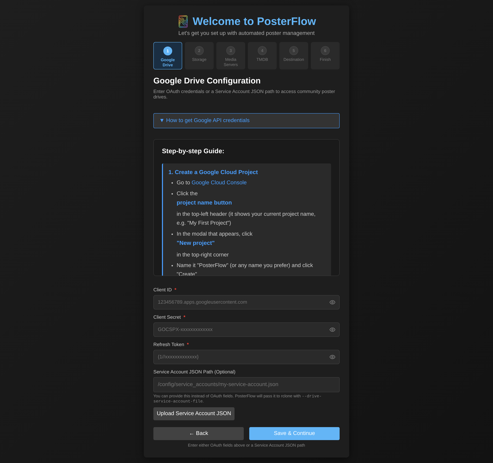
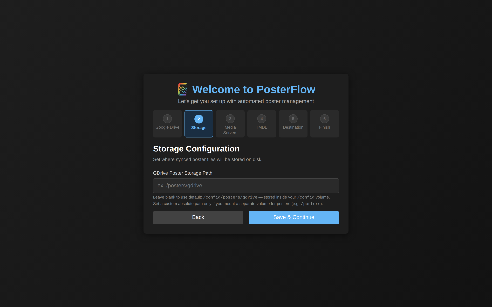
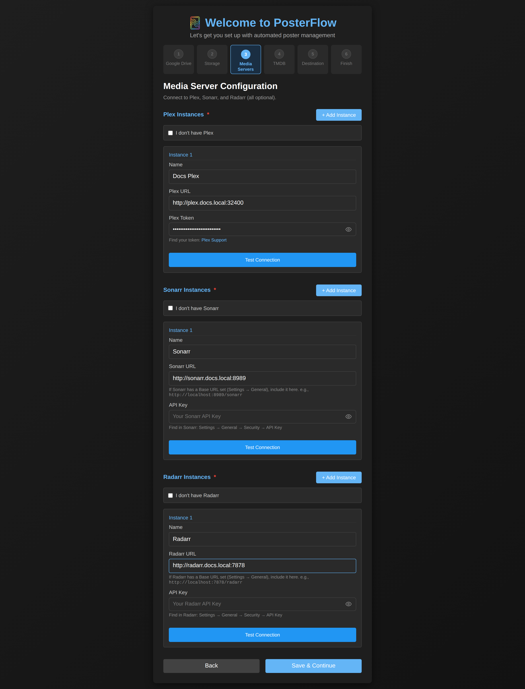
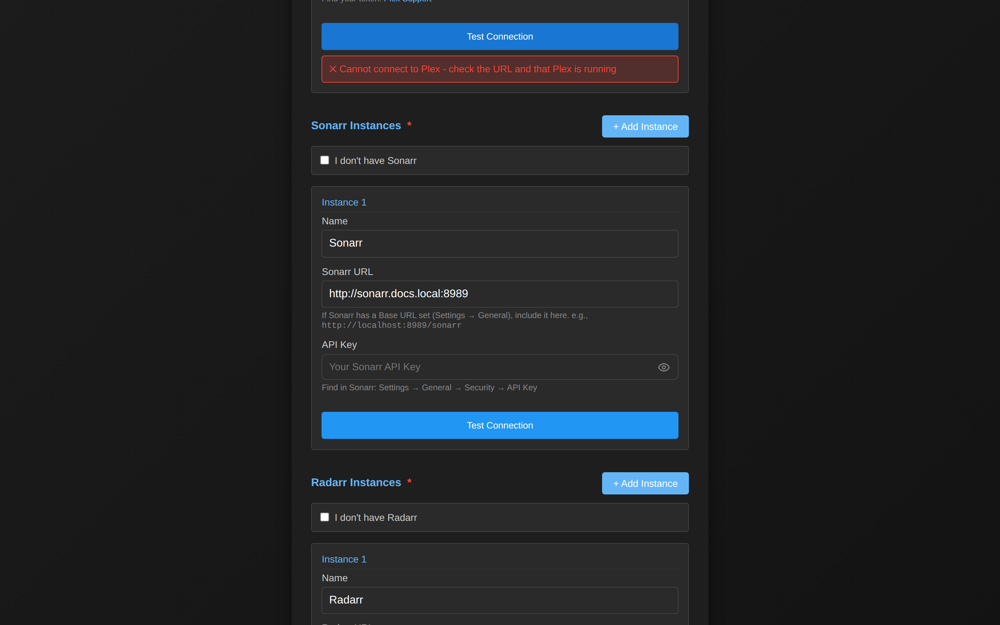
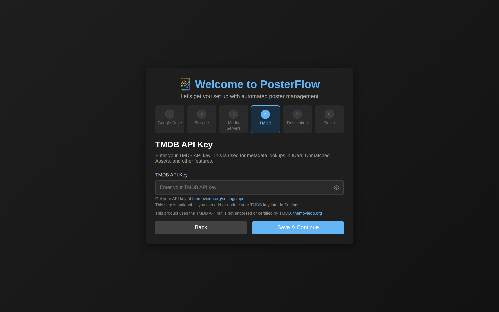
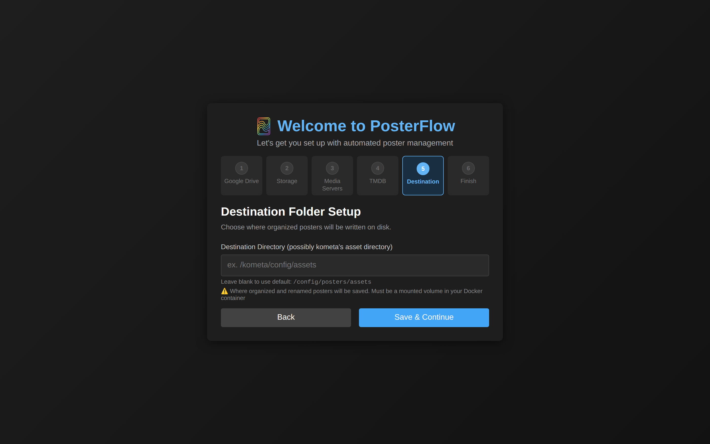
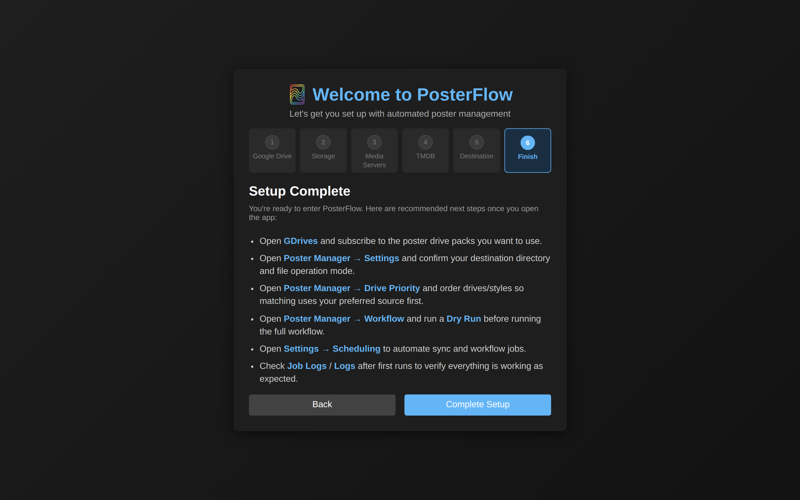

# Setup Wizard

On a fresh `/config` the SPA detects `setup_complete=false` and routes you to `/setup`. The wizard walks through seven screens — one Welcome screen plus six numbered steps — and writes every entered value through `POST /api/settings/bulk` as it advances. Only the Welcome screen and Step 3 (Media Servers) talk to the backend for anything other than a settings write; everything else is a pure form-to-DB persist.

The wizard is implemented in [`frontend/src/pages/SetupWizard.tsx`](https://github.com/dweagle/posterflow/blob/develop/frontend/src/pages/SetupWizard.tsx) (~1300 LOC) and is the only consumer of [`backend/api/setup.py`](https://github.com/dweagle/posterflow/blob/develop/backend/api/setup.py), which exposes exactly one endpoint: `GET /api/setup/status`. The "Re-run Setup Wizard" button in Settings re-routes you here without resetting any of the values you've already saved.

## State and replay

The wizard tracks no per-step state on the server. There is no `wizard_step` setting in the database. The whole wizard is a thin client over `/api/settings/bulk`, so:

- **Quitting partway through** leaves the values you've already saved in place. Reload the wizard from `/setup` (or from the "Re-run Setup Wizard" button in Settings) and continue from Step 1; previously-entered values are read back from the DB on each step.
- **Replaying after completion** is supported. The "Re-run Setup Wizard" button at the top right of Settings re-routes to `/setup`. Nothing is wiped — the wizard pre-fills with current settings and lets you change them.
- **Marking setup complete** is a single bulk write of `setup_complete=true`, which the SPA sends from Step 6's "Complete Setup" button. Skipping the wizard from the Welcome screen does the same thing.

## Step 0 — Welcome

*The first screen on a fresh `/config`. Three exclusive choices.*

| Card | What it does |
|---|---|
| Start Fresh | Advances to Step 1. |
| Restore Backup | Opens a file picker (accept: `.zip`). Uploads via `POST /api/backup/` and triggers a Restart Required modal on success. See [`backup-restore.md`](backup-restore.md) for the zip schema and what gets overwritten. |
| Skip Setup | Writes `setup_complete=true` via `POST /api/settings/bulk` and routes to `/`. You'll need to fill everything in from Settings later. |

## Step 1 — Google Drive

*Step 1 with the credential instructions collapsed.*

Four fields. You need either the three OAuth fields, **or** the service-account JSON path. The wizard does not validate Google credentials at this point — the values are written to the DB and only exercised when a sync actually runs against `rclone` (see [`drives.md`](drives.md#rclone-invocation)).

| Field | Required? | Persisted as | Notes |
|---|---|---|---|
| Client ID | One of these three | `google_client_id` | The OAuth 2.0 client ID for a Desktop application in your Google Cloud project. Looks like `123456789012.apps.googleusercontent.com`. |
| Client Secret | One of these three | `google_client_secret` (masked) | The matching client secret. Looks like `GOCSPX-…`. |
| Refresh Token | One of these three | `google_refresh_token` (masked) | A long-lived refresh token. Looks like `1//…`. |
| Service Account JSON Path | Or this one | `google_service_account_file` | Absolute container path to a service-account JSON file you have mounted in. Use this for unattended sync without an interactive OAuth flow. PosterFlow passes the file to `rclone` via `--drive-service-account-file`. |

### How to get an OAuth client + refresh token

Expanding "How to get Google API credentials" reveals five sub-steps. They are also reproduced here for grep-ability:

*The expanded instructions panel. Each numbered step has links to the relevant Google Cloud console pages.*

1. **Create a Google Cloud project** at [console.cloud.google.com](https://console.cloud.google.com/projectcreate). Any project will do; you don't need billing enabled.
2. **Enable the Google Drive API** at [console.cloud.google.com/apis/library/drive.googleapis.com](https://console.cloud.google.com/apis/library/drive.googleapis.com).
3. **Configure the OAuth consent screen.** Set the user type to External, fill in app name and contact email, add yourself as a Test User. You do not need to publish the app — Test User mode is sufficient.
4. **Create OAuth 2.0 credentials.** Application type: Desktop app. Copy the client ID and client secret straight into the wizard.
5. **Generate a refresh token.** The easiest path is `rclone config` on any host: pick `drive`, paste the client ID and secret, complete the browser flow, then `cat ~/.config/rclone/rclone.conf` and copy the `token` value (just the refresh portion). The wizard accepts the entire `{"access_token":…,"refresh_token":…}` JSON; PosterFlow parses out what it needs when it writes `/config/rclone.conf`. Alternatively, the [OAuth Playground](https://developers.google.com/oauthplayground/) works for makers who already have an interactive workflow they prefer.

### How to use a service account instead

Easier for headless setups. Create a service account in your project, generate a JSON key, mount it into the container at any path (for example, mount your host file at `/config/service_accounts/posterflow.json`), and paste the container-side path into the wizard.

If you populate both OAuth fields and the service-account path, PosterFlow will use the service account — `rclone` prefers `--drive-service-account-file` when present.

> Note: the wizard cannot verify either credential type — failures show up later as `rclone` exit codes in the sync job log. See [`troubleshooting.md`](troubleshooting.md#rclone-auth-fails) for the substrings to grep for.

## Step 2 — Storage

*Step 2. Optional override for where rclone writes its cache.*

A single optional field: **GDrive Poster Storage Path** (`gdrive_storage_path` setting). Leave blank and PosterFlow writes synced files into `/config/posters/gdrive/` (default from `backend/core/config.py`). Set this to an absolute container path if you've mounted a separate volume for poster downloads — for example, if you want the gdrive cache to live on a dedicated bulk-storage mount instead of co-located with the database.

The setting is read at startup (`backend/main.py` lines 240–250) and again whenever a sync job spawns. Changing it later does **not** move existing files — you'll get duplicates if you change paths without first migrating the cache yourself.

## Step 3 — Media Servers

*Step 3. Each section has "+ Add Instance" to declare more than one server, and "I don't have …" to skip a server class entirely.*

This is the only step that touches anything other than the settings table. The Test Connection buttons call:

- `POST /api/test/plex` → uses `plexapi.PlexServer(url, token)` and returns the server version on success.
- `POST /api/test/sonarr` → `GET <url>/api/v3/system/status` with `X-Api-Key: <api_key>` (`backend/util/arr/client.py`).
- `POST /api/test/radarr` → same, against `/api/v3/system/status`.

Each test has a 10-second timeout server-side. The wizard does **not** block advancing if a test fails — you can save a misconfigured instance and the rest of the app will throw errors later. The intended flow is: fill, test, see the green check, then save.

### Plex

| Field | Required? | Persisted in | Notes |
|---|---|---|---|
| Name | yes | `plex_instances[].name` | Free-form. Used as the display name in logs and the library picker. |
| Plex URL | yes | `plex_instances[].url` | Reachable from inside the container. Use `http://host.docker.internal:32400` on Docker Desktop, or the LAN IP on Linux. |
| Plex Token | yes | `plex_instances[].api_key` (masked) | A user token, **not** a server token. Retrieval: [support.plex.tv — Finding an Authentication Token](https://support.plex.tv/articles/204059436-finding-an-authentication-token-x-plex-token/). |

You can declare multiple Plex servers (4K and 1080p libraries, separate household servers, etc.) by clicking "+ Add Instance". Each gets its own URL/token pair. The Poster Renamer and Plex Upload jobs fan out across all configured instances.

### Sonarr / Radarr

Identical structure to Plex except the credential field is **API Key**, not Token. Retrieval: Sonarr → Settings → General → Security → API Key; Radarr → identical path. Each instance is persisted in `sonarr_instances` / `radarr_instances` as a JSON array of `{name, url, api_key}`.

### The escape hatch

Each section has an "I don't have Plex" / "I don't have Sonarr" / "I don't have Radarr" checkbox. Ticking it lets you advance without filling in that section. PosterFlow will then skip the corresponding integration at runtime — the renamer will simply not have Plex collections to match against, the unmatched detector won't have a Sonarr library to compare, and so on. You can always go back and add these later from Settings → Media Servers.

### What a failed test looks like

*The captured wizard fixture saves `http://plex.docs.local:32400` as the URL, which doesn't resolve — that's what the error looks like for a DNS or routing failure. A wrong token produces a different message (`Unauthorized`).*

## Step 4 — TMDB API Key

*Step 4. Optional, but you'll want it before running Unmatched Detection.*

One field: **TMDB API Key** (`tmdb_api_key`, masked). Optional during the wizard; you can add it later from Settings. Without it, the Unmatched Assets report cannot generate TMDB links and the Maker Tools TMDB Search tab is non-functional.

Get a key at [themoviedb.org/settings/api](https://www.themoviedb.org/settings/api) — sign in, create an account if needed, request an API key (v3 auth is what PosterFlow uses). The v3 key is a hex string like `0123456789abcdef…`; do not paste a v4 bearer token.

> Note: per the wizard's footer text, "This product uses the TMDB API but is not endorsed or certified by TMDB" — the standard required attribution. If you redistribute screenshots that include TMDB content, this attribution applies.

## Step 5 — Destination Folder

*Step 5. Where organized, renamed, bordered posters land.*

One field: **Destination Directory** (`poster_destination`). Leave blank and PosterFlow writes to `/config/posters/assets/`. Set it to anything else if you have a Kometa assets mount — for example, `/assets` if you used the optional `/assets` mount from the canonical compose (see [`install.md`](install.md#volumes)). This must be a container path that the `posterflow` user can write to.

The destination is the single most important path in the app. Every job downstream of the renamer reads from or writes to it:

- The Border Replacer reads from `<dest>/tmp/` (or `<dest>/`) and writes back to `<dest>/`.
- Unmatched Detection scans `<dest>/` to determine what's missing.
- Plex Upload walks `<dest>/` to find files to upload.
- The "auto-run Border after Renamer" toggle assumes the renamer wrote into `<dest>/tmp/`.

Changing this after the fact in Settings is supported but you should not have jobs running when you do.

## Step 6 — Setup Complete

*Step 6. Clicking Complete Setup writes `setup_complete=true` and routes to the dashboard.*

A static checklist of recommended next actions. Clicking "Complete Setup" sends `POST /api/settings/bulk` with `{ setup_complete: "true" }` and navigates you to `/`. Recommended order, also reproduced here:

1. [GDrives](drives.md) → subscribe to one or more poster drives.
2. [Poster Manager → Settings](jobs.md) → confirm the destination directory matches Step 5.
3. [Poster Manager → Drive Priority](jobs.md#poster-renamer) → order which drive's poster wins when multiple drives have artwork for the same title.
4. [Poster Manager → Workflow](jobs.md#workflow) → run a dry-run workflow to validate matching before doing anything destructive.
5. [Settings → Scheduling](scheduler.md) → automate the workflow on whatever cadence suits your library churn.
6. [Logs](live-status.md) → check live and job-specific logs to confirm the first scheduled run completed.

## Re-running the wizard later

The Settings page exposes a "Re-run Setup Wizard" button in its top-right corner (visible in any of the [Settings screenshots](configuration.md)). It simply navigates back to `/setup`. Your existing values are read back into the form on each step. There is no "reset to defaults" path — to start completely fresh you must either restore from a clean backup or delete the database file (`/config/posterflow.db` plus any `-wal` / `-shm` siblings) while the container is stopped.

## What gets written where

After a wizard run that fills every field, the SQLite `settings` table contains:

| Key | Step | Sensitive? |
|---|---|---|
| `google_client_id` | 1 | no |
| `google_client_secret` | 1 | yes — masked on read |
| `google_refresh_token` | 1 | yes — masked on read |
| `google_service_account_file` | 1 | no (path only) |
| `gdrive_storage_path` | 2 | no |
| `plex_instances` | 3 | per-instance `api_key` masked |
| `sonarr_instances` | 3 | per-instance `api_key` masked |
| `radarr_instances` | 3 | per-instance `api_key` masked |
| `tmdb_api_key` | 4 | yes — masked |
| `poster_destination` | 5 | no |
| `setup_complete` | 6 | no |

See [`configuration.md`](configuration.md) for the full setting catalog and [`security.md`](security.md#sensitive-data-on-disk) for how secrets are stored on disk.
