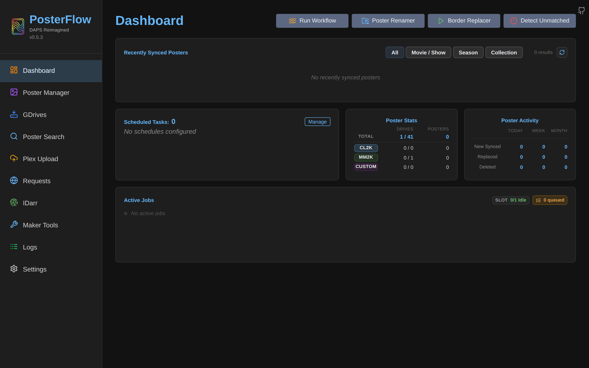

# Upgrade

PosterFlow upgrades are pull-and-restart. There is no separate "upgrade" step, no migration command — the container itself runs Alembic migrations during the lifespan startup ([`install.md`](install.md#first-boot)).

## Image tags

From [`.github/workflows/build-docker.yml`](https://github.com/dweagle/posterflow/blob/develop/.github/workflows/build-docker.yml):

| Tag | Source branch | Trigger | Multi-arch |
|---|---|---|---|
| `dweagle/posterflow:latest` | `main` | Manual (`workflow_dispatch`) | linux/amd64 + linux/arm64 |
| `dweagle/posterflow:develop` | `develop` | Manual (`workflow_dispatch`) | linux/amd64 + linux/arm64 |

That's it. No SemVer tags (`v0.5.3`, `0.5.3`), no major-only tags (`0`, `0.5`), no daily-dated tags, no per-PR images. The maintainer runs the workflow manually when they're ready to publish; until that happens, the registry's `develop` and `latest` lag the source.

A consequence: pinning to a specific version requires building locally. If you've shipped 0.5.3 in production and you want to roll forward to 0.5.4 *only*, you cannot — you must take `develop` (which may include 0.5.5 / 0.5.6 changes if the maintainer hasn't pushed yet) and roll forward, then handle any subsequent issues. If this is important to you, build locally:

```bash
git clone --depth=1 --branch develop https://github.com/dweagle/posterflow.git
cd posterflow
# Check what's in VERSION; check git log for the SHA of the version you want
docker build -t posterflow:0.5.3 .
```

And update your compose file:

```yaml
services:
  posterflow:
    image: posterflow:0.5.3
    # ...
```

## Standard upgrade procedure

For most operators running `dweagle/posterflow:develop` from Docker Hub:

```bash
docker compose pull posterflow
docker compose up -d posterflow
```

The compose v2 default is to recreate the container if the image changed. The new container starts, the lifespan runs migrations (idempotent — already-applied migrations are skipped), the app comes up healthy. Total downtime: usually under 10 seconds.

For `latest`:

```bash
# Identical, just a different tag.
docker compose pull posterflow
docker compose up -d posterflow
```

## What runs at startup on an upgrade

Same as a fresh boot ([`install.md`](install.md#first-boot)), but specifically for upgrades:

1. **Alembic migrations apply.** Every migration newer than the recorded `alembic_version` runs in order. Each is transactional. If a migration fails, the lifespan raises and the container won't reach the healthy state — see [`troubleshooting.md`](troubleshooting.md#migration-failed).

2. **Stale-job cleanup.** Any job in `running` or `pending` from the previous container's life is marked `failed` with the message `Job interrupted by application restart`.

3. **History prune.** Jobs older than retention (30 days completed, 14 days failed, max 750 per type) are deleted.

4. **Drive cache reload.** The community drive list is re-fetched; deprecated drives are flagged.

5. **Persisted debug toggle restored.** If you toggled debug on via the UI before the upgrade, it stays on.

6. **APScheduler reloads schedules.** Every enabled schedule re-registers.

If any of these fail at non-critical points (drive fetch, scheduler), the lifespan logs a warning and continues. If migrations fail, the container exits — that's a stop-the-world failure.

## Rolling back

The official path is to roll back the image:

```bash
docker compose stop posterflow
# Edit compose to pin a previous image SHA or a locally-built older tag:
#   image: dweagle/posterflow@sha256:<old digest>
docker compose up -d posterflow
```

The hard problem with rollback is **migrations don't auto-downgrade**. Each Alembic migration has a `downgrade()` function in principle, but you have to run it manually with the right Alembic version:

```bash
docker exec -it posterflow alembic downgrade -1
```

And then roll the image back. In practice, the recommended rollback is:

1. **Stop the new container**.
2. **Restore your DB from the pre-upgrade backup** (`/config/safety_backups/<latest>/posterflow.db` if you ran the wizard's Restore Backup; otherwise from your nightly backup).
3. **Pin the image to the previous version**.
4. **Start the container**.

If the upgrade was a minor schema change with no destructive migration, downgrading the image without restoring the DB usually works — Alembic just sees a higher `alembic_version` than its known migrations and either ignores it or fails noisily on startup (depending on Alembic's behavior).

The safest rollback is therefore: always take a backup before upgrading. The built-in backup endpoint is one click; do it.

## Checking the current version

In the container, the `VERSION` file in the project root holds the base version (`0.5.3` at the time of these docs). The running version is exposed at:

```bash
curl -s http://localhost:8357/api/version
# 0.5.3   or   0.5.3.develop   (if the BRANCH env var was set during build)
```

The richer endpoint:

```bash
curl -s -H "Authorization: Bearer <pwd>" http://localhost:8357/api/version/update | jq .
{
  "current_version": "0.5.3.develop",
  "latest_version": "0.5.5",
  "update_available": true,
  "versions_behind": 2,
  "releases_url": "https://github.com/dweagle/posterflow/releases",
  "release_notes": "### v0.5.5\n…",
  "repo": "dweagle/posterflow"
}
```

This polls `api.github.com/repos/dweagle/posterflow/releases` (3 pages, 20 entries per page, so up to 60 releases scanned). The Dashboard sidebar uses this to show an "Update Available" badge.

The badge means a higher SemVer tag has been published to **GitHub Releases**, which is independent of Docker Hub. If a 0.5.5 release exists but the maintainer hasn't pushed the corresponding `develop` image, `docker pull` will not get the new code — you have to wait for the image, or build locally.


*The sidebar's version line at top-left. Clicking it opens a release-notes popover with the newest releases ahead of the running version. The "Update Available" badge sits next to the version when `update_available=true` in `/api/version/update`.*

## Changelog

The full changelog lives at the top level: [`CHANGELOG.md`](https://github.com/dweagle/posterflow/blob/develop/CHANGELOG.md). It is updated as part of the same commit that bumps `VERSION`. Read it before upgrading; the maintainer documents breaking changes in the `### Changed` and (rarely) `### Removed` sections.

Notable recent items to read for context if you're coming from an older install:

- **0.5.0** (2026-05-22) introduced Community Poster Requests, which use Supabase. If you didn't run the wizard's Restore Backup with the new schema, the Community Requests sidebar item won't function. Migration `0001_initial` covers the schema; existing installs are forward-compatible.
- **0.4.0** (2026-05-15) added Maker Tools' TMDB Search. The Sidebar IDarr nav now accepts drag-drop — be aware if you have custom CSS overrides.
- **0.4.2** (2026-05-17) added Photopea integration; the CORS allowance for `https://www.photopea.com` is set by default. Don't remove it from `CORS_ORIGINS` unless you don't use the feature.
- **0.5.2** (2026-05-24) changed IDarr's collision handling — duplicates are archived to a `duplicates/` directory rather than renamed with numeric suffixes. If you had scripts that expected the old behavior, fix them.

## Image build provenance

For audit purposes:

- All published images are built by the maintainer's GitHub Actions workflow under their personal Docker Hub account (`dweagle`).
- Multi-arch images are built with `docker/build-push-action@v6` and pushed via `docker/login-action@v3` using a repo secret.
- The build runs the backend test suite (`python -m pytest -q tests/`) and the frontend tests (`npm run test`) before pushing. If either fails, no image is pushed.
- There is no SBOM or image signature published. If your supply-chain policy requires cosign-signed images, you'll need to build locally and sign yourself.

## In-place upgrade caveats

Two caveats nobody enjoys discovering during an outage:

1. **A schema migration that takes a long time blocks the lifespan.** On a 50k-poster install, Alembic migrations run in well under a second — so this is mostly a non-issue. But if a future migration adds an index across a 100M-row table, the container will sit "starting" for minutes. Plan upgrades for off-peak hours just in case.

2. **The websocket connections drop.** Every connected browser must reconnect when the container restarts. PosterFlow's SPA reconnects automatically (the connection-closed handler triggers a `connect` after a backoff), but any third-party client you've written must do the same. See [`live-status.md`](live-status.md#consuming-from-a-custom-client) for an example.
